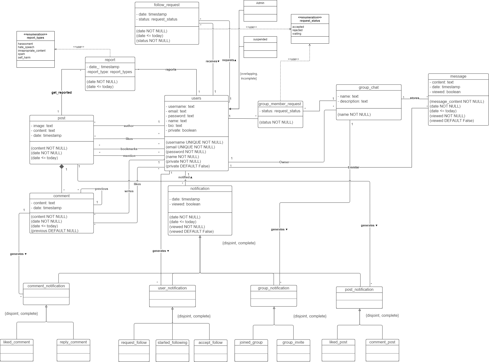

# EBD: Database Specification Component

At the heart of our project vision for Feupbook is the unwavering commitment to creating an innovative and vibrant social network tailored specifically for the students of the Faculty of Engineering at the University of Porto (FEUP). We envision Feupbook as a dynamic and inclusive online ecosystem, revolutionizing the way FEUP students connect, share, and engage within their academic community.

## A4: Conceptual Data Model

In this section the entities and relationships that exist in the Feupbook project are described, as well as its database specification.

Figure 1: Feupbook UML

### 1. Class diagram



### 4.2 Additional Business Rules

Additional business rules that cannot be perceived in the UML diagram.

| Identifier | Description                                                                                                    |
| ---------- | -------------------------------------------------------------------------------------------------------------- |
| BR7        | A user can only like a post once.                                                                              |
| BR8        | A user can only like a comment once.                                                                           |
| BR9        | A user can only send messages to a group chat they belong to.                                                  |
| BR10       | A user can only comment on posts from public users or from people they follow.                                 |
| BR11       | A user cannot follow themselves.                                                                               |
| BR12       | A user cannot be added to a group chat that he/she is already part of.                                         |
| BR13       | A user cannot request to follow someone they already follow.                                                   |
| BR14       | The group chat owner is also part of the group chat, meaning he/she can also send messages on that group chat. |

Table 13: Additional business rules

---

## A5: Relational Schema, validation and schema refinement

This part presents the relational schema derived from an examination of the conceptual data model. It includes details about each relational schema, its attributes, domains, primary keys, foreign keys, and essential integrity rules like uniqueness, default values, non-null constraints, and checks.

### 5.1 Relational Schema

| Relation reference | Relation Compact Notation                                                                                                                                                                                                                                                                                                                                                                                                                                                                                                                                                                                                                                                                                                                                                         |
| ------------------ | --------------------------------------------------------------------------------------------------------------------------------------------------------------------------------------------------------------------------------------------------------------------------------------------------------------------------------------------------------------------------------------------------------------------------------------------------------------------------------------------------------------------------------------------------------------------------------------------------------------------------------------------------------------------------------------------------------------------------------------------------------------------------------- |
| R01                | users(<ins>user_id</ins>, username **UK NN**, email **UK NN**, password **NN**, name **NN**, bio, private **NN DF** false, user_type **NN CK** user_type **IN** user_types)                                                                                                                                                                                                                                                                                                                                                                                                                                                                                                                                                                                                       |
| R02                | post(<ins>post_id</ins>, owner_id → users **NN**, image, content, date **NN CK** date <= today)                                                                                                                                                                                                                                                                                                                                                                                                                                                                                                                                                                                                                                                                                   |
| R03                | comment(<ins>comment_id</ins>, author_id->users **NN**, post_id->post **NN**, content, date **NN CK** date <= today, previous->comment **DF** null)                                                                                                                                                                                                                                                                                                                                                                                                                                                                                                                                                                                                                               |
| R04                | notification(<ins>notification_id</ins>, date **NN CK** date <= today, notified_user->users **NN**, notification_type **NN CK** (notification_type **IN** ('liked_comment', 'reply_comment') **AND** (post_id **IS NULL AND** group_id **IS NULL**)) **OR** (notification_type **IN** ('request_follow', 'started_following', 'accept_follow') **AND** (comment_id **IS NULL AND** post_id **IS NULL AND** group_id **IS NULL**)) **OR** (notification_type **IN** ('joined_group', 'group_invite') **AND** (comment_id **IS NULL AND** post_id **IS NULL**)) **OR** (notification_type **IN** ('liked_post', 'comment_post') **AND** (comment_id **IS NULL AND** group_id **IS NULL**)), comment_id -> comment, post_id -> post, group_id -> group_chat, viewed **NN DF** false) |
| R05                | message(<ins>message_id</ins>, emitter_id->users **NN**, group_id->group_chat **NN**, content **NN**, date **NN CK** date <= today, viewed **NN DF** false)                                                                                                                                                                                                                                                                                                                                                                                                                                                                                                                                                                                                                       |
| R06                | follow_request(req_id->users **NN**, rcv_id->users **NN**, date **NN CK** date <= today, status **NN CK** status **IN** request_status)                                                                                                                                                                                                                                                                                                                                                                                                                                                                                                                                                                                                                                           |
| R07                | group_chat(<ins>group_id</ins>, owner_id->user **NN**, name **NN**, description)                                                                                                                                                                                                                                                                                                                                                                                                                                                                                                                                                                                                                                                                                                  |
| R08                | group_member(<ins>user_id -> users</ins>, <ins>group_id -> group_chat</ins>, status **NN CK** status **IN** request_status)                                                                                                                                                                                                                                                                                                                                                                                                                                                                                                                                                                                                                                                       |
| R09                | post_likes(<ins>user_id->users</ins>, <ins>post_id->post</ins>)                                                                                                                                                                                                                                                                                                                                                                                                                                                                                                                                                                                                                                                                                                                   |
| R10                | comment_likes(<ins>user_id->users</ins>, <ins>comment_id->comment</ins>)                                                                                                                                                                                                                                                                                                                                                                                                                                                                                                                                                                                                                                                                                                          |
| R11                | mention(<ins>post_id -> post</ins>, <ins>user_mentioned -> users</ins>)                                                                                                                                                                                                                                                                                                                                                                                                                                                                                                                                                                                                                                                                                                           |
| R12                | bookmarks(<ins>bookmarked_post -> post</ins>, <ins>user_id -> users</ins>)                                                                                                                                                                                                                                                                                                                                                                                                                                                                                                                                                                                                                                                                                                        |
| R13                | report (<ins>report_id</ins>, user_id->users, post_id->post, date **NN CK** date <= today, report_type **NN CK** report_type **IN** report_types)                                                                                                                                                                                                                                                                                                                                                                                                                                                                                                                                                                                                                                 |

Table 14: Feupbook Relational Schema

Legend:

- The underlined parameters refer to PRIMARY KEYS;
- UK = UNIQUE;
- NN = NOT NULL;
- DF = DEFAULT;
- CK = CHECK;

### 2. Domains

Specification of additional domains.

| Domain Name        | Domain Specification                                                                                                                                                              |
| ------------------ | --------------------------------------------------------------------------------------------------------------------------------------------------------------------------------- |
| Today              | DATE DEFAULT CURRENT_DATE                                                                                                                                                         |
| user_types         | ENUM('normal_user','admin', 'suspended')                                                                                                                                          |
| notification_types | ENUM ('liked_comment', 'reply_comment', 'comment_tagging', 'request_follow', 'started_following', 'accepted_follow', 'joined_group', 'accept_join', 'liked_post', 'comment_post') |
| report_types       | ENUM ('harassment', 'hate_speech', 'inappropriate_content', 'spam', 'self_harm')                                                                                                  |
| request_status     | ENUM ('accepted', 'rejected', 'waiting')                                                                                                                                          |

### 3. Schema validation

All functional dependencies are presented and the normalization of all relation schemas is done.

| **R01**                      | Users                                                          |
| ---------------------------- | -------------------------------------------------------------- |
| **Keys**                     | {user_id}                                                      |
| **Functional Dependencies:** |                                                                |
| FD0101                       | user_id → {username, email, password, bio, private, user_type} |
| **NORMAL FORM**              | BCNF                                                           |

Table 16: Users schema validation

| **R02**                      | Post                                       |
| ---------------------------- | ------------------------------------------ |
| **Keys**                     | {post_id}                                  |
| **Functional Dependencies:** |                                            |
| FD0201                       | post_id → {owner_id, image, content, date} |
| **NORMAL FORM**              | BCNF?                                      |

Table 17: Post schema validation

| **R03**                      | Comment                                                    |
| ---------------------------- | ---------------------------------------------------------- |
| **Keys**                     | {comment_id}                                               |
| **Functional Dependencies:** |                                                            |
| FD0301                       | comment_id → {author_id, post_id, content, date, previous} |
| **NORMAL FORM**              | BCNF                                                       |

Table 18: Comment schema validation

| **R04**                      | Notification                                                                                      |
| ---------------------------- | ------------------------------------------------------------------------------------------------- |
| **Keys**                     | {notification_id}                                                                                 |
| **Functional Dependencies:** |                                                                                                   |
| FD0401                       | notification_id → {date, notified_user, notification_type, comment_id, post_id, group_id, viewed} |
| **NORMAL FORM**              | BCNF                                                                                              |

Table 19: Notification schema validation

| **R05**                      | Message                                                    |
| ---------------------------- | ---------------------------------------------------------- |
| **Keys**                     | {message_id}                                               |
| **Functional Dependencies:** |                                                            |
| FD0901                       | message_id → {emitter_id, group_id, content, date, viewed} |
| **NORMAL FORM**              | BCNF                                                       |

Table 20: Message schema validation

| **R06**                      | Follow_requests                   |
| ---------------------------- | --------------------------------- |
| **Keys**                     | {req_id}                          |
|                              | {rcv_id}                          |
| **Functional Dependencies:** |                                   |
| FD1001                       | {req_id, rdv_id} → {date, status} |
| **NORMAL FORM**              | BCNF                              |

Table 21: Follow_requests schema validation

| **R07**                      | Group_chat                                 |
| ---------------------------- | ------------------------------------------ |
| **Keys**                     | {group_id}                                 |
| **Functional Dependencies:** |                                            |
| FD1101                       | {group_id} → {owner_id, name, description} |
| **NORMAL FORM**              | BCNF                                       |

Table 22: Group_chat schema validation

| **R08**                      | Group_member                   |
| ---------------------------- | ------------------------------ |
| **Keys**                     | {user_id}                      |
|                              | {group_id}                     |
| **Functional Dependencies:** |                                |
| FD1201                       | {user_id, group_id} → {status} |
| **NORMAL FORM**              | BCNF                           |

Table 23: Group_member schema validation

| **R09**                      | post_likes              |
| ---------------------------- | ----------------------- |
| **Keys**                     | {user_id}               |
|                              | {post_id}               |
| **Functional Dependencies:** |                         |
| FD1401                       | {user_id, post_id} → {} |
| **NORMAL FORM**              | BCNF                    |

Table 24: post_likes schema validation

| **R10**                      | Comment_likes              |
| ---------------------------- | -------------------------- |
| **Keys**                     | {user_id}                  |
|                              | {comment_id}               |
| **Functional Dependencies:** |                            |
| FD1501                       | {user_id, comment_id} → {} |
| **NORMAL FORM**              | BCNF                       |

Table 25: Comment_likes schema validation

| **R11**                      | Mention                        |
| ---------------------------- | ------------------------------ |
| **Keys**                     | {post_id}                      |
|                              | {user_mentioned}               |
| **Functional Dependencies:** |                                |
| FD1601                       | {post_id, user_mentioned} → {} |
| **NORMAL FORM**              | BCNF                           |

Table 26: Mention schema validation

| **R12**                      | Bookmarks                       |
| ---------------------------- | ------------------------------- |
| **Keys**                     | {bookmarked_post}               |
|                              | {user_id}                       |
| **Functional Dependencies:** |                                 |
| FD1601                       | {bookmarked_post, user_id} → {} |
| **NORMAL FORM**              | BCNF                            |

Table 27: Bookmarks schema validation

| **R13**                      | Report                                              |
| ---------------------------- | --------------------------------------------------- |
| **Keys**                     | {report_id}                                         |
| **Functional Dependencies:** |                                                     |
| FD1601                       | {report_id} → {user_id, post_id, date, report_type} |
| **NORMAL FORM**              | BCNF                                                |

Table 28: Report schema validation

Since all relationships adhere to the Boyce–Codd Normal Form (BCNF), the relational schema itself is also in BCNF. Consequently, there is no requirement for any additional normalization of the schema.

---

## A6: Indexes, triggers, transactions and database population

In essence, the A6 artifact houses the PostgreSQL code, encapsulating the tangible structure of the database along with its data, the enforcement of data integrity through triggers, the identification and profiling of indexes, and the specification of user-defined functions for the database.

Moreover, it elucidates the necessary transactions for maintaining data accuracy following any interactions or modifications made within the database. Additionally, it provides a detailed explanation of the required isolation level.

### 1. Database Workload

To create a well-designed database, it's crucial to have a clear understanding of how a table will evolve and how frequently it will be accessed. The following table presents these anticipated forecasts:

| **Relation reference** | **Relation Name** | **Order of magnitude** | **Estimated growth** |
| ---------------------- | ----------------- | ---------------------- | -------------------- |
| RW01                   | users             | 10 k                   | 100/day              |
| RW02                   | post              | 10 k                   | 1 k/week             |
| RW03                   | comment           | 10 k                   | 1 k/week             |
| RW04                   | notification      | 10 k                   | 1 k/week             |
| RW05                   | message           | 10 k                   | 100/day              |
| RW06                   | follow_request    | 10 k                   | 100/day              |
| RW07                   | group_chat        | 100                    | 10/week              |
| RW08                   | group_member      | 1 k                    | 10/day               |
| RW09                   | post_likes        | 10 k                   | 1 k/week             |
| RW10                   | comment_likes     | 1 k                    | 10/day               |
| RW11                   | mention           | 1 k                    | 10/day               |
| RW12                   | admin             | 1                      | 1/day                |
| RW13                   | suspended         | 100                    | 1/day                |
| RW14                   | bookmarks         | 1 k                    | 10/day               |
| RW15                   | report            | 1 k                    | 10/day               |

Table 29: Feupbook Workload

### 2. Proposed Indices

We've employed indexes to enhance the database's performance, enabling it to swiftly locate and retrieve specific rows.

#### 2.1. Performance Indices

Certain queries often suffer from prolonged execution times. By utilizing performance indexes, we can enhance the speed of SELECT queries. The subsequent tables illustrate the performance indexes in use:

| **Index**         | IDX01                                                                                                                                                                                                                                                                                                                                                                    |
| ----------------- | ------------------------------------------------------------------------------------------------------------------------------------------------------------------------------------------------------------------------------------------------------------------------------------------------------------------------------------------------------------------------ |
| **Relation**      | post                                                                                                                                                                                                                                                                                                                                                                     |
| **Attribute**     | owner_id                                                                                                                                                                                                                                                                                                                                                                 |
| **Type**          | Hash                                                                                                                                                                                                                                                                                                                                                                     |
| **Cardinality**   | Medium                                                                                                                                                                                                                                                                                                                                                                   |
| **Clustering**    | No                                                                                                                                                                                                                                                                                                                                                                       |
| **Justification** | In a social network, posts are made quite often which makes the table 'post' to be somewhat substantial. Consequently, it is both frequent and necessary to search for the user who authored each post, typically by performing exact matches with their IDs. Given the low update frequency and medium cardinality, this situation makes hash tables a suitable choice. |
| SQL code          | `CREATE INDEX owner_id_post ON post USING hash (owner_id);`                                                                                                                                                                                                                                                                                                              |

Table 30: Post Owner Index

| **Index**         | IDX02                                                                                                                                                                                                                                                                                                                                                                             |
| ----------------- | --------------------------------------------------------------------------------------------------------------------------------------------------------------------------------------------------------------------------------------------------------------------------------------------------------------------------------------------------------------------------------- |
| **Relation**      | comment                                                                                                                                                                                                                                                                                                                                                                           |
| **Attribute**     | author_id                                                                                                                                                                                                                                                                                                                                                                         |
| **Type**          | Hash                                                                                                                                                                                                                                                                                                                                                                              |
| **Cardinality**   | Medium                                                                                                                                                                                                                                                                                                                                                                            |
| **Clustering**    | No                                                                                                                                                                                                                                                                                                                                                                                |
| **Justification** | In a social network, comments are made quite often which makes the table 'comment' to be somewhat substantial. Consequently, it is both frequent and necessary to search for the user who authored each comment, typically by performing exact matches with their IDs. Given the low update frequency and medium cardinality, this situation makes hash tables a suitable choice. |
| SQL code          | `CREATE INDEX author_id_comment ON comment USING hash (author_id);`                                                                                                                                                                                                                                                                                                               |

Table 31: Comment Author Index

| **Index**         | IDX03                                                                                                                                                                                                                                                                                                                                                                                                                                       |
| ----------------- | ------------------------------------------------------------------------------------------------------------------------------------------------------------------------------------------------------------------------------------------------------------------------------------------------------------------------------------------------------------------------------------------------------------------------------------------- |
| **Relation**      | notification                                                                                                                                                                                                                                                                                                                                                                                                                                |
| **Attribute**     | notified_user                                                                                                                                                                                                                                                                                                                                                                                                                               |
| **Type**          | Hash                                                                                                                                                                                                                                                                                                                                                                                                                                        |
| **Cardinality**   | Medium                                                                                                                                                                                                                                                                                                                                                                                                                                      |
| **Clustering**    | Yes                                                                                                                                                                                                                                                                                                                                                                                                                                         |
| **Justification** | In a social network, users are constantly receiving notifications about posts, comments and messages. Consequently, the table 'notification' is very extense. There is often the need to identify who was the notified user, typically by performing exact matches with their IDs, thus an hash type index would be best suited. Given the low update frequency and medium cardinality, this situation makes hash tables a suitable choice. |
| SQL code          | `CREATE INDEX notified_user_notification ON notification USING btree (notified_user);`                                                                                                                                                                                                                                                                                                                                                      |

Table 32: Notified User Index

| **Index**         | IDX04                                                                                                                                                                                                                                                                                                                                                                                                                                     |
| ----------------- | ----------------------------------------------------------------------------------------------------------------------------------------------------------------------------------------------------------------------------------------------------------------------------------------------------------------------------------------------------------------------------------------------------------------------------------------- |
| **Relation**      | notification                                                                                                                                                                                                                                                                                                                                                                                                                              |
| **Attribute**     | emitter_user                                                                                                                                                                                                                                                                                                                                                                                                                              |
| **Type**          | Hash                                                                                                                                                                                                                                                                                                                                                                                                                                      |
| **Cardinality**   | Medium                                                                                                                                                                                                                                                                                                                                                                                                                                    |
| **Clustering**    | Yes                                                                                                                                                                                                                                                                                                                                                                                                                                       |
| **Justification** | In a social network, users are constantly receiving notifications about posts, comments and messages. Consequently, the table 'notification' is very extense. There is often the need to identify who made a notification, typically by performing exact matches with their IDs, thus an hash type index would be best suited. Given the low update frequency and medium cardinality, this situation makes hash tables a suitable choice. |
| SQL code          | `CREATE INDEX emitter_user_notification ON notification USING btree (emitter_user);`                                                                                                                                                                                                                                                                                                                                                      |

Table 33: Emitter User Index

| **Index**         | IDX05                                                                                                                                                                                                                                                                                                                                                                                                                                                                  |
| ----------------- | ---------------------------------------------------------------------------------------------------------------------------------------------------------------------------------------------------------------------------------------------------------------------------------------------------------------------------------------------------------------------------------------------------------------------------------------------------------------------- |
| **Relation**      | bookmarks                                                                                                                                                                                                                                                                                                                                                                                                                                                              |
| **Attribute**     | user_id                                                                                                                                                                                                                                                                                                                                                                                                                                                                |
| **Type**          | B-tree                                                                                                                                                                                                                                                                                                                                                                                                                                                                 |
| **Cardinality**   | Medium                                                                                                                                                                                                                                                                                                                                                                                                                                                                 |
| **Clustering**    | Yes                                                                                                                                                                                                                                                                                                                                                                                                                                                                    |
| **Justification** | In a social network, users are constantly bookmarking posts, in order to save them. Consequently, the table 'bookmarks' is very extense. There is often the need to identify the posts bookmarked by a specific user. As we want to cluster the table based on the `user_id` attribute (so we have the bookmarks ordered by user), a b-tree index is the best suited. Given the low update frequency and medium cardinality, it presents a good choice for clustering. |
| SQL code          | `CREATE INDEX user_id_bookmarks ON bookmarks USING btree (user_id);`<br><br>`CLUSTER bookmarks USING user_id_bookmarks;`                                                                                                                                                                                                                                                                                                                                               |

Table 34: Bookmark User Index

#### 2.2. Full-text Search Indices

In order to enhance text search efficiency, we've established Full-Text Search (FTS) indexes on the tables and attributes we anticipated would undergo the most queries. You can locate these indexes in the following tables:

| **Index**         | IDX06                                                                                                                                                                                                                                                                                                                                                                                                                                                                                                                                                                                                                                                                                                                                                                                                                                                                                                                                                                                                                                                                                                                                                                                                                                                                                                                                                                                                                                                              |
| ----------------- | ------------------------------------------------------------------------------------------------------------------------------------------------------------------------------------------------------------------------------------------------------------------------------------------------------------------------------------------------------------------------------------------------------------------------------------------------------------------------------------------------------------------------------------------------------------------------------------------------------------------------------------------------------------------------------------------------------------------------------------------------------------------------------------------------------------------------------------------------------------------------------------------------------------------------------------------------------------------------------------------------------------------------------------------------------------------------------------------------------------------------------------------------------------------------------------------------------------------------------------------------------------------------------------------------------------------------------------------------------------------------------------------------------------------------------------------------------------------ |
| **Relation**      | users                                                                                                                                                                                                                                                                                                                                                                                                                                                                                                                                                                                                                                                                                                                                                                                                                                                                                                                                                                                                                                                                                                                                                                                                                                                                                                                                                                                                                                                              |
| **Attribute**     | name, username, bio                                                                                                                                                                                                                                                                                                                                                                                                                                                                                                                                                                                                                                                                                                                                                                                                                                                                                                                                                                                                                                                                                                                                                                                                                                                                                                                                                                                                                                                |
| **Type**          | GIN                                                                                                                                                                                                                                                                                                                                                                                                                                                                                                                                                                                                                                                                                                                                                                                                                                                                                                                                                                                                                                                                                                                                                                                                                                                                                                                                                                                                                                                                |
| **Clustering**    | No                                                                                                                                                                                                                                                                                                                                                                                                                                                                                                                                                                                                                                                                                                                                                                                                                                                                                                                                                                                                                                                                                                                                                                                                                                                                                                                                                                                                                                                                 |
| **Justification** | To offer comprehensive full-text search capabilities for locating users based on matching names or usernames. We've chosen the GIN index type for this purpose, as the indexed fields are not anticipated to undergo frequent changes.                                                                                                                                                                                                                                                                                                                                                                                                                                                                                                                                                                                                                                                                                                                                                                                                                                                                                                                                                                                                                                                                                                                                                                                                                             |
| SQL code          | `-- Add column to user to store computed ts_vectors.` <br><br> `ALTER TABLE users` <br><br> `ADD COLUMN tsvectors TSVECTOR;` <br><br> `-- Create a function to automatically update ts_vectors.` <br><br> `CREATE FUNCTION user_search_update() RETURNS TRIGGER AS $$` <br><br> `BEGIN` <br><br> `IF TG_OP = 'INSERT' THEN` <br><br> `NEW.tsvectors = (` <br><br> `setweight(to_tsvector('portuguese', NEW.name), 'A') \|\|` <br><br> `setweight(to_tsvector('portuguese', NEW.username), 'B') \|\|` <br><br> `setweight(to_tsvector('portuguese', NEW.bio), 'C')` <br><br> `);` <br><br> `END IF;` <br><br> `IF TG_OP = 'UPDATE' THEN` <br><br> `IF (NEW.name <> OLD.name OR NEW.username <> OLD.username  OR NEW.bio <> OLD.bio) THEN` <br><br> `NEW.tsvectors = (` <br><br> `setweight(to_tsvector('portuguese', NEW.name), 'A') \|\|` <br><br> `setweight(to_tsvector('portuguese', NEW.username), 'B') \|\|` <br><br> `setweight(to_tsvector('portuguese', NEW.bio), 'C')` <br><br> `);` <br><br> `END IF;` <br><br> `END IF;` <br><br> `RETURN NEW;` <br><br> `END $$` <br><br> `LANGUAGE plpgsql;` <br><br> `-- Create a trigger before insert or update on users` <br><br> `CREATE TRIGGER user_search_update` <br><br> `BEFORE INSERT OR UPDATE ON users` <br><br> `FOR EACH ROW` <br><br> `EXECUTE PROCEDURE user_search_update();` <br><br> `-- Create a GIN index for ts_vectors.` <br><br> `CREATE INDEX search_user ON users USING GIN (tsvectors);` |

Table 35: User Full-Text Search Index

| **Index**         | IDX07                                                                                                                                                                                                                                                                                                                                                                                                                                                                                                                                                                                                                                                                                                                                                                                                                                                                                                                                                                                                                                     |
| ----------------- | ----------------------------------------------------------------------------------------------------------------------------------------------------------------------------------------------------------------------------------------------------------------------------------------------------------------------------------------------------------------------------------------------------------------------------------------------------------------------------------------------------------------------------------------------------------------------------------------------------------------------------------------------------------------------------------------------------------------------------------------------------------------------------------------------------------------------------------------------------------------------------------------------------------------------------------------------------------------------------------------------------------------------------------------- |
| **Relation**      | post                                                                                                                                                                                                                                                                                                                                                                                                                                                                                                                                                                                                                                                                                                                                                                                                                                                                                                                                                                                                                                      |
| **Attribute**     | content                                                                                                                                                                                                                                                                                                                                                                                                                                                                                                                                                                                                                                                                                                                                                                                                                                                                                                                                                                                                                                   |
| **Type**          | GIN                                                                                                                                                                                                                                                                                                                                                                                                                                                                                                                                                                                                                                                                                                                                                                                                                                                                                                                                                                                                                                       |
| **Clustering**    | No                                                                                                                                                                                                                                                                                                                                                                                                                                                                                                                                                                                                                                                                                                                                                                                                                                                                                                                                                                                                                                        |
| **Justification** | To offer comprehensive full-text search capabilities for locating posts based on matching content. We've chosen the GIN index type for this purpose, as the indexed fields are not anticipated to undergo frequent changes.                                                                                                                                                                                                                                                                                                                                                                                                                                                                                                                                                                                                                                                                                                                                                                                                               |
| SQL code          | `-- Add column to post to store computed ts_vectors.` <br><br> `ALTER TABLE post` <br><br> `ADD COLUMN tsvectors TSVECTOR;` <br><br> `-- Create a function to automatically update ts_vectors.` <br><br> `CREATE FUNCTION post_search_update() RETURNS TRIGGER AS $$` <br><br> `BEGIN` <br><br> `IF TG_OP = 'INSERT' THEN` <br><br> `NEW.tsvectors = to_tsvector('portuguese', NEW.content);` <br><br> `END IF;` <br><br> `IF TG_OP = 'UPDATE' THEN` <br><br> `IF (NEW.content <> OLD.content) THEN` <br><br> `NEW.tsvectors = to_tsvector('portuguese', NEW.content);` <br><br> `END IF;` <br><br> `END IF;` <br><br> `RETURN NEW;` <br><br> `END $$` <br><br> `LANGUAGE plpgsql;` <br><br> `-- Create a trigger before insert or update on post` <br><br> `CREATE TRIGGER post_search_update` <br><br> `BEFORE INSERT OR UPDATE ON post` <br><br> `FOR EACH ROW` <br><br> `EXECUTE PROCEDURE post_search_update();` <br><br> `-- Create a GIN index for ts_vectors.` <br><br> `CREATE INDEX search_post ON post USING GIN (tsvectors);` |

Table 36: Post Full-Text Search Index

| **Index**         | IDX08                                                                                                                                                                                                                                                                                                                                                                                                                                                                                                                                                                                                                                                                                                                                                                                                                                                                                                                                                                                                                                                       |
| ----------------- | ----------------------------------------------------------------------------------------------------------------------------------------------------------------------------------------------------------------------------------------------------------------------------------------------------------------------------------------------------------------------------------------------------------------------------------------------------------------------------------------------------------------------------------------------------------------------------------------------------------------------------------------------------------------------------------------------------------------------------------------------------------------------------------------------------------------------------------------------------------------------------------------------------------------------------------------------------------------------------------------------------------------------------------------------------------- |
| **Relation**      | comment                                                                                                                                                                                                                                                                                                                                                                                                                                                                                                                                                                                                                                                                                                                                                                                                                                                                                                                                                                                                                                                     |
| **Attribute**     | content                                                                                                                                                                                                                                                                                                                                                                                                                                                                                                                                                                                                                                                                                                                                                                                                                                                                                                                                                                                                                                                     |
| **Type**          | GIN                                                                                                                                                                                                                                                                                                                                                                                                                                                                                                                                                                                                                                                                                                                                                                                                                                                                                                                                                                                                                                                         |
| **Clustering**    | No                                                                                                                                                                                                                                                                                                                                                                                                                                                                                                                                                                                                                                                                                                                                                                                                                                                                                                                                                                                                                                                          |
| **Justification** | To offer comprehensive full-text search capabilities for locating comments based on matching content. We've chosen the GIN index type for this purpose, as the indexed fields are not anticipated to undergo frequent changes.                                                                                                                                                                                                                                                                                                                                                                                                                                                                                                                                                                                                                                                                                                                                                                                                                              |
| SQL code          | `-- Add column to comment to store computed ts_vectors.` <br><br> `ALTER TABLE comment` <br><br> `ADD COLUMN tsvectors TSVECTOR;` <br><br> `-- Create a function to automatically update ts_vectors.` <br><br> `CREATE FUNCTION comment_search_update() RETURNS TRIGGER AS $$` <br><br> `BEGIN` <br><br> `IF TG_OP = 'INSERT' THEN` <br><br> `NEW.tsvectors = to_tsvector('portuguese', NEW.content);` <br><br> `END IF;` <br><br> `IF TG_OP = 'UPDATE' THEN` <br><br> `IF (NEW.content <> OLD.content) THEN` <br><br> `NEW.tsvectors = to_tsvector('portuguese', NEW.content);` <br><br> `END IF;` <br><br> `END IF;` <br><br> `RETURN NEW;` <br><br> `END $$` <br><br> `LANGUAGE plpgsql;` <br><br> `-- Create a trigger before insert or update on comment` <br><br> `CREATE TRIGGER post_search_update` <br><br> `BEFORE INSERT OR UPDATE ON post` <br><br> `FOR EACH ROW` <br><br> `EXECUTE PROCEDURE comment_search_update();` <br><br> `-- Create a GIN index for ts_vectors.` <br><br> `CREATE INDEX search_comment ON post USING GIN (tsvectors);` |

Table 37: Comment Full-Text Search Index

| **Index**         | IDX09                                                                                                                                                                                                                                                                                                                                                                                                                                                                                                                                                                                                                                                                                                                                                                                                                                                                                                                                                                                                                                                                                                                                                                                                                                                                                                                                               |
| ----------------- | --------------------------------------------------------------------------------------------------------------------------------------------------------------------------------------------------------------------------------------------------------------------------------------------------------------------------------------------------------------------------------------------------------------------------------------------------------------------------------------------------------------------------------------------------------------------------------------------------------------------------------------------------------------------------------------------------------------------------------------------------------------------------------------------------------------------------------------------------------------------------------------------------------------------------------------------------------------------------------------------------------------------------------------------------------------------------------------------------------------------------------------------------------------------------------------------------------------------------------------------------------------------------------------------------------------------------------------------------- |
| **Relation**      | group_chat                                                                                                                                                                                                                                                                                                                                                                                                                                                                                                                                                                                                                                                                                                                                                                                                                                                                                                                                                                                                                                                                                                                                                                                                                                                                                                                                          |
| **Attribute**     | name, description                                                                                                                                                                                                                                                                                                                                                                                                                                                                                                                                                                                                                                                                                                                                                                                                                                                                                                                                                                                                                                                                                                                                                                                                                                                                                                                                   |
| **Type**          | GIN                                                                                                                                                                                                                                                                                                                                                                                                                                                                                                                                                                                                                                                                                                                                                                                                                                                                                                                                                                                                                                                                                                                                                                                                                                                                                                                                                 |
| **Clustering**    | No                                                                                                                                                                                                                                                                                                                                                                                                                                                                                                                                                                                                                                                                                                                                                                                                                                                                                                                                                                                                                                                                                                                                                                                                                                                                                                                                                  |
| **Justification** | To offer comprehensive full-text search capabilities for locating group chats based on matching names or descriptions. We've chosen the GIN index type for this purpose, as the indexed fields are not anticipated to undergo frequent changes.                                                                                                                                                                                                                                                                                                                                                                                                                                                                                                                                                                                                                                                                                                                                                                                                                                                                                                                                                                                                                                                                                                     |
| SQL code          | `-- Add column to user to store computed ts_vectors.` <br><br> `ALTER TABLE group_chat` <br><br> `ADD COLUMN tsvectors TSVECTOR;` <br><br> `-- Create a function to automatically update ts_vectors.` <br><br> `CREATE FUNCTION group_chat_search_update() RETURNS TRIGGER AS $$` <br><br> `BEGIN` <br><br> `IF TG_OP = 'INSERT' THEN` <br><br> `NEW.tsvectors = (` <br><br> `setweight(to_tsvector('portuguese', NEW.name), 'A') \|\|` <br><br> `setweight(to_tsvector('portuguese', NEW.description), 'B')` <br><br> `);` <br><br> `END IF;` <br><br> `IF TG_OP = 'UPDATE' THEN` <br><br> `IF (NEW.name <> OLD.name OR NEW.description <> OLD.description) THEN` <br><br> `NEW.tsvectors = (` <br><br> `setweight(to_tsvector('portuguese', NEW.name), 'A') \|\|` <br><br> `setweight(to_tsvector('portuguese', NEW.description), 'B')` <br><br> `);` <br><br> `END IF;` <br><br> `END IF;` <br><br> `RETURN NEW;` <br><br> `END $$` <br><br> `LANGUAGE plpgsql;` <br><br> `-- Create a trigger before insert or update on users` <br><br> `CREATE TRIGGER group_chat_search_update` <br><br> `BEFORE INSERT OR UPDATE ON group_chat` <br><br> `FOR EACH ROW` <br><br> `EXECUTE PROCEDURE group_chat_search_update();` <br><br> `-- Create a GIN index for ts_vectors.` <br><br> `CREATE INDEX search_group_chat ON users USING GIN (tsvectors);` |

Table 38: Group Chat Full-Text Search Index

### 3. Triggers

> User-defined functions and trigger procedures that add control structures to the SQL language or perform complex computations, are identified and described to be trusted by the database server. Every kind of function (SQL functions, Stored procedures, Trigger procedures) can take base types, composite types, or combinations of these as arguments (parameters). In addition, every kind of function can return a base type or a composite type. Functions can also be defined to return sets of base or composite values.

| **Trigger**     | TRIGGER01                                                                                                                                                                                                                                                                                                                                                                                                                                                                                                                                  |
| --------------- | ------------------------------------------------------------------------------------------------------------------------------------------------------------------------------------------------------------------------------------------------------------------------------------------------------------------------------------------------------------------------------------------------------------------------------------------------------------------------------------------------------------------------------------------ |
| **Description** | This trigger sends a notification to a user when someone sends them a friend request.                                                                                                                                                                                                                                                                                                                                                                                                                                                      |
| SQL Code        | `CREATE FUNCTION notify_follow_request() RETURNS TRIGGER AS` <br><br> `$BODY$` <br><br> `BEGIN` <br><br> `    INSERT INTO notifications (user_id, message, created_at)` <br><br> `VALUES (NEW.receiver_id, 'You have a new friend request from ' \|\| NEW.sender_name);` <br><br> `RETURN NEW;` <br><br> `END` <br><br> `$BODY$` <br><br> `LANGUAGE plpgsql;` <br><br> `CREATE TRIGGER notify_follow_request` <br><br> `    AFTER INSERT ON follow_requests` <br><br> `FOR EACH ROW` <br><br> `EXECUTE PROCEDURE notify_follow_request();` |

| **Trigger**     | TRIGGER02                                                                                                                                                                                                                                                                                                                                                                                                                                                                                                                |
| --------------- | ------------------------------------------------------------------------------------------------------------------------------------------------------------------------------------------------------------------------------------------------------------------------------------------------------------------------------------------------------------------------------------------------------------------------------------------------------------------------------------------------------------------------ |
| **Description** | This trigger automatically rejects inappropriate posts based on a list of keywords.                                                                                                                                                                                                                                                                                                                                                                                                                                      |
| SQL Code        | `CREATE FUNCTION reject_inappropriate_posts() RETURNS TRIGGER AS` <br><br> `$BODY$` <br><br> `BEGIN` <br><br> `IF NEW.content ILIKE ANY (ARRAY['%inappropriate%', '%offensive%', '%spam%']) THEN` <br><br> `return NULL;` <br><br> `END IF;` <br><br> ` RETURN NEW;` <br><br> `END` <br><br> `$BODY$` <br><br> `LANGUAGE plpgsql;` <br><br> `CREATE TRIGGER reject_inappropriate_posts` <br><br> `    BEFORE INSERT ON posts` <br><br> `    FOR EACH ROW` <br><br> `    EXECUTE PROCEDURE reject_inappropriate_posts();` |

| **Trigger**     | TRIGGER03                                                                                                                                                                                                                                                                                                                                                                                                                                                                                                                                                                                                        |
| --------------- | ---------------------------------------------------------------------------------------------------------------------------------------------------------------------------------------------------------------------------------------------------------------------------------------------------------------------------------------------------------------------------------------------------------------------------------------------------------------------------------------------------------------------------------------------------------------------------------------------------------------- |
| **Description** | This trigger ensures that a user only likes a post once.                                                                                                                                                                                                                                                                                                                                                                                                                                                                                                                                                         |
| SQL Code        | `CREATE OR REPLACE FUNCTION prevent_duplicate_post_likes();` <br><br> `RETURNS TRIGGER AS $$` <br><br> `BEGIN` <br><br> `IF EXISTS (` <br><br> `SELECT 1` <br><br> `FROM post_likes` <br><br> `WHERE user_id = NEW.user_id AND post_id = NEW.post_id` <br><br> `) THEN` <br><br> `RAISE EXCEPTION 'User has already liked this post.';` <br><br> `END IF;` <br><br> `RETURN NEW;` <br><br> `END;` <br><br> `$$ LANGUAGE plpgsql;` <br><br> `CREATE TRIGGER enforce_unique_post_likes` <br><br> `BEFORE INSERT ON post_likes` <br><br> `FOR EACH ROW` <br><br> `EXECUTE FUNCTION prevent_duplicate_post_likes();` |

| **Trigger**     | TRIGGER05                                                                                                                                                                                                                                                                                                                                                                                                                                                                                                                                                                                                                                     |
| --------------- | --------------------------------------------------------------------------------------------------------------------------------------------------------------------------------------------------------------------------------------------------------------------------------------------------------------------------------------------------------------------------------------------------------------------------------------------------------------------------------------------------------------------------------------------------------------------------------------------------------------------------------------------- |
| **Description** | This trigger ensures that a user can only send messages to a group chat they belong to.                                                                                                                                                                                                                                                                                                                                                                                                                                                                                                                                                       |
| SQL Code        | `CREATE OR REPLACE FUNCTION enforce_message_sender_membership()` <br><br> `RETURNS TRIGGER AS $$` <br><br> `BEGIN` <br><br> `IF NOT EXISTS (` <br><br> `SELECT 1` <br><br> `FROM group_member` <br><br> `WHERE user_id = NEW.emitter_id AND group_id = NEW.group_id` <br><br> `) THEN` <br><br> `RAISE EXCEPTION 'User is not a member of the group chat.';` <br><br> `END IF;` <br><br> `RETURN NEW;` <br><br> `END;` <br><br> `$$ LANGUAGE plpgsql;` <br><br> `CREATE TRIGGER check_message_sender_membership` <br><br> `BEFORE INSERT ON message` <br><br> `FOR EACH ROW` <br><br> `EXECUTE FUNCTION enforce_message_sender_membership();` |

| **Trigger**     | TRIGGER06                                                                                                                                                                                                                                                                                                                                                                                                                                                                                                                                                                                                                                                                                                                                                                                                                                               |
| --------------- | ------------------------------------------------------------------------------------------------------------------------------------------------------------------------------------------------------------------------------------------------------------------------------------------------------------------------------------------------------------------------------------------------------------------------------------------------------------------------------------------------------------------------------------------------------------------------------------------------------------------------------------------------------------------------------------------------------------------------------------------------------------------------------------------------------------------------------------------------------- |
| **Description** | This trigger ensures that a user can only comment on posts of public users or users they follow.                                                                                                                                                                                                                                                                                                                                                                                                                                                                                                                                                                                                                                                                                                                                                        |
| SQL Code        | `CREATE OR REPLACE FUNCTION enforce_comment_privacy()` <br><br> `RETURNS TRIGGER AS $$` <br><br> `BEGIN` <br><br> `IF NOT EXISTS (` <br><br> `SELECT 1` <br><br> `FROM users AS post_owner` <br><br> `WHERE post_owner.user_id = NEW.author_id` <br><br> `AND (post_owner.private = false OR EXISTS (` <br><br> `SELECT 1` <br><br> `FROM follow_request` <br><br> `WHERE req_id = NEW.author_id` <br><br> `AND rcv_id = post_owner.user_id` <br><br> `AND status = 'accepted'` <br><br> `))` <br><br> `) THEN` <br><br> `RAISE EXCEPTION 'User is not allowed to comment on this post.';` <br><br> `END IF;` <br><br> `RETURN NEW;` <br><br> `END;` <br><br> `$$ LANGUAGE plpgsql;` <br><br> `CREATE TRIGGER check_comment_privacy` <br><br> `BEFORE INSERT ON comment` <br><br> `FOR EACH ROW` <br><br> `EXECUTE FUNCTION enforce_comment_privacy();` |

| **Trigger**     | TRIGGER07                                                                                                                                                                                                                                                                                                                                                                                                                                                                                                    |
| --------------- | ------------------------------------------------------------------------------------------------------------------------------------------------------------------------------------------------------------------------------------------------------------------------------------------------------------------------------------------------------------------------------------------------------------------------------------------------------------------------------------------------------------ |
| **Description** | This trigger ensures that a user can not follow themselves.                                                                                                                                                                                                                                                                                                                                                                                                                                                  |
| SQL Code        | `CREATE OR REPLACE FUNCTION prevent_self_follow()` <br><br> `RETURNS TRIGGER AS $$` <br><br> `BEGIN` <br><br> `IF NEW.req_id = NEW.rcv_id THEN` <br><br> `        RAISE EXCEPTION 'A user cannot send a follow request to themselves.';` <br><br> `    END IF;` <br><br> `    RETURN NEW;` <br><br> `END;` <br><br> `$$ LANGUAGE plpgsql;` <br><br> `CREATE TRIGGER check_self_follow` <br><br> `BEFORE INSERT ON follow_request` <br><br> `FOR EACH ROW` <br><br> `EXECUTE FUNCTION prevent_self_follow();` |

| **Trigger**     | TRIGGER08                                                                                                                                                                                                                                                                                                                                                                                                                                                                                                                                                                                                                                                                                           |
| --------------- | --------------------------------------------------------------------------------------------------------------------------------------------------------------------------------------------------------------------------------------------------------------------------------------------------------------------------------------------------------------------------------------------------------------------------------------------------------------------------------------------------------------------------------------------------------------------------------------------------------------------------------------------------------------------------------------------------- |
| **Description** | This trigger ensures that a user cannot be added to a group chat they are already a part of.                                                                                                                                                                                                                                                                                                                                                                                                                                                                                                                                                                                                        |
| SQL Code        | `CREATE OR REPLACE FUNCTION prevent_duplicate_group_membership()` <br><br> `RETURNS TRIGGER AS $$` <br><br> `BEGIN` <br><br> `    IF EXISTS (` <br><br> `        SELECT 1` <br><br> `        FROM group_member` <br><br> `        WHERE user_id = NEW.user_id AND group_id = NEW.group_id` <br><br> `     ) THEN` <br><br> `        RAISE EXCEPTION 'User is already a member of this group chat.';` <br><br> `    END IF;` <br><br> `    RETURN NEW;` <br><br> `END;` <br><br> `$$ LANGUAGE plpgsql;` <br><br> `CREATE TRIGGER enforce_unique_group_membership` <br><br> `BEFORE INSERT ON group_member` <br><br> `FOR EACH ROW` <br><br> `EXECUTE FUNCTION prevent_duplicate_group_membership();` |

| **Trigger**     | TRIGGER09                                                                                                                                                                                                                                                                                                                                                                                                                                                                                                                                                                                                                                                                                                                                                                      |
| --------------- | ------------------------------------------------------------------------------------------------------------------------------------------------------------------------------------------------------------------------------------------------------------------------------------------------------------------------------------------------------------------------------------------------------------------------------------------------------------------------------------------------------------------------------------------------------------------------------------------------------------------------------------------------------------------------------------------------------------------------------------------------------------------------------ |
| **Description** | This trigger ensures that a user cannot send a follow request to someone they arleady follow.                                                                                                                                                                                                                                                                                                                                                                                                                                                                                                                                                                                                                                                                                  |
| SQL Code        | `CREATE OR REPLACE FUNCTION prevent_duplicate_follow_request()` <br><br> `RETURNS TRIGGER AS $$` <br><br> `BEGIN` <br><br> `    IF EXISTS (` <br><br> `        SELECT 1` <br><br> `        FROM follow_request` <br><br> `        WHERE req_id = NEW.req_id AND rcv_id = NEW.rcv_id` <br><br> `        AND (status = 'pending' OR status = 'accepted')` <br><br> `    ) THEN` <br><br> `        RAISE EXCEPTION 'User has already requested to follow or is already following.';` <br><br> `    END IF;` <br><br> `    RETURN NEW;` <br><br> `END;` <br><br> `$$ LANGUAGE plpgsql;` <br><br> `CREATE TRIGGER enforce_unique_follow_request` <br><br> `BEFORE INSERT ON follow_request` <br><br> `FOR EACH ROW` <br><br> `EXECUTE FUNCTION prevent_duplicate_follow_request();` |

| **Trigger**     | TRIGGER10                                                                                                                                                                                                                                                                                                                                                                                                                                                                                                                                                                                                                                                                                |
| --------------- | ---------------------------------------------------------------------------------------------------------------------------------------------------------------------------------------------------------------------------------------------------------------------------------------------------------------------------------------------------------------------------------------------------------------------------------------------------------------------------------------------------------------------------------------------------------------------------------------------------------------------------------------------------------------------------------------- |
| **Description** | This trigger ensure that the group chat owner is also part of the group chat.                                                                                                                                                                                                                                                                                                                                                                                                                                                                                                                                                                                                            |
| SQL Code        | `CREATE OR REPLACE FUNCTION ensure_owner_is_member()` <br><br> `RETURNS TRIGGER AS $$` <br><br> `BEGIN` <br><br> `    IF NOT EXISTS (` <br><br> `        SELECT 1` <br><br> `        FROM group_member` <br><br> `        WHERE user_id = NEW.owner_id AND group_id = NEW.group_id` <br><br> `    ) THEN` <br><br> `        RAISE EXCEPTION 'The group chat owner must be a member of the group chat.';` <br><br> `    END IF;` <br><br> `    RETURN NEW;` <br><br> `END;` <br><br> `$$ LANGUAGE plpgsql;` <br><br> ``<br><br> `CREATE TRIGGER check_owner_membership`<br><br> `BEFORE INSERT ON group_chat`<br><br> `FOR EACH ROW`<br><br> `EXECUTE FUNCTION ensure_owner_is_member();` |

### 4. Transactions

> Transactions needed to assure the integrity of the data.

| Transaction         | TRANSACTION01                                                                                                                                                                                                                                                                                                                                                                                                                                                                                                                                                                                                                                                   |
| ------------------- | --------------------------------------------------------------------------------------------------------------------------------------------------------------------------------------------------------------------------------------------------------------------------------------------------------------------------------------------------------------------------------------------------------------------------------------------------------------------------------------------------------------------------------------------------------------------------------------------------------------------------------------------------------------- |
| Justification       | Repeatable read is used in order to avoid storing inconsistent data when an update / insert in the mentions table occurs by another concurrent process.                                                                                                                                                                                                                                                                                                                                                                                                                                                                                                         |
| Isolation level     | REPEATABLE READ                                                                                                                                                                                                                                                                                                                                                                                                                                                                                                                                                                                                                                                 |
| `Complete SQL Code` | `-- Set the isolation level to Repeatable Read` <br> `SET TRANSACTION ISOLATION LEVEL REPEATABLE READ;` <br><br> `-- Begin the transaction` <br> `BEGIN;` <br><br> `-- Create the post and obtain the post_id`<br> `INSERT INTO post (owner_id, content, date)` <br> `VALUES (:ownerId, :content, NOW())` <br> `RETURNING post_id INTO newpost_id;` <br><br> `-- Create mention records for the post by extracting mentions from the content` <br> `INSERT INTO mention (post_id, user_mentioned)` <br> `SELECT newpost_id, regexp_matches(:content, '@([A-Za-z0-9_]+)', 'g');` <br><br> `-- Commit the transaction if everything is successful` <br> `COMMIT;` |

## Annex A. SQL Code

> The database scripts are included in this annex to the EBD component.
>
> The database creation script and the population script should be presented as separate elements.
> The creation script includes the code necessary to build (and rebuild) the database.
> The population script includes an amount of tuples suitable for testing and with plausible values for the fields of the database.
>
> The complete code of each script must be included in the group's git repository and links added here.

### A.1. Database schema

> The complete database creation must be included here and also as a script in the repository.

```
--
-- Use a specific schema and set it as default - lbaw23141
--

DROP SCHEMA IF EXISTS lbaw23141 CASCADE;
CREATE SCHEMA IF NOT EXISTS lbaw23141;
SET search_path TO lbaw23141;

--
--DROP the old schema
--
DROP TABLE IF EXISTS notification CASCADE;
DROP TABLE IF EXISTS message CASCADE;
DROP TABLE IF EXISTS group_member CASCADE;
DROP TABLE IF EXISTS group_chat CASCADE;
DROP TABLE IF EXISTS report CASCADE;
DROP TABLE IF EXISTS bookmarks CASCADE;
DROP TABLE IF EXISTS mention CASCADE;
DROP TABLE IF EXISTS comment_likes CASCADE;
DROP TABLE IF EXISTS post_likes CASCADE;
DROP TABLE IF EXISTS follow_request CASCADE;
DROP TABLE IF EXISTS comment CASCADE;
DROP TABLE IF EXISTS post CASCADE;
DROP TABLE IF EXISTS users CASCADE;

DROP TYPE IF EXISTS user_types;
DROP TYPE IF EXISTS notification_types;
DROP TYPE IF EXISTS report_types;
DROP TYPE IF EXISTS request_status;

DROP FUNCTION IF EXISTS user_search_update CASCADE;
DROP FUNCTION IF EXISTS post_search_update CASCADE;
DROP FUNCTION IF EXISTS comment_search_update CASCADE;
DROP FUNCTION IF EXISTS group_chat_search_update CASCADE;
DROP FUNCTION IF EXISTS notify_follow_request CASCADE;
DROP FUNCTION IF EXISTS reject_inappropriate_posts CASCADE;

-- Create ENUM types
CREATE TYPE user_types AS ENUM ('normal_user', 'admin', 'suspended');
CREATE TYPE notification_types AS ENUM ('liked_comment', 'reply_comment', 'comment_tagging', 'request_follow', 'started_following', 'accepted_follow', 'joined_group', 'accept_join', 'liked_post', 'comment_post');
CREATE TYPE report_types AS ENUM ('harassment', 'hate_speech', 'inappropriate_content', 'spam', 'self_harm');
CREATE TYPE request_status AS ENUM ('accepted', 'rejected', 'waiting');

-- Table: users (R01)
CREATE TABLE users (
    user_id SERIAL PRIMARY KEY,
    username VARCHAR(255) UNIQUE NOT NULL,
    email VARCHAR(255) UNIQUE NOT NULL,
    password VARCHAR(255) NOT NULL,
    name VARCHAR(255) NOT NULL,
    bio TEXT,
    private BOOLEAN NOT NULL DEFAULT false,
    user_type VARCHAR(50) NOT NULL CHECK (user_type IN ('user_types'))
);

-- Table: post (R02)
CREATE TABLE post (
    post_id SERIAL PRIMARY KEY,
    owner_id INTEGER REFERENCES users(user_id) NOT NULL,
    image TEXT,
    content TEXT,
    date DATE NOT NULL CHECK (date <= CURRENT_DATE)
);

-- Table: comment (R03)
CREATE TABLE comment (
    comment_id SERIAL PRIMARY KEY,
    author_id INTEGER REFERENCES users(user_id) NOT NULL,
    post_id INTEGER REFERENCES post(post_id) NOT NULL,
    content TEXT,
    date DATE NOT NULL CHECK (date <= CURRENT_DATE),
    previous INTEGER REFERENCES comment(comment_id) DEFAULT NULL
);

-- Table: group_chat (R07)
CREATE TABLE group_chat (
    group_id SERIAL PRIMARY KEY,
    owner_id INTEGER REFERENCES users(user_id) NOT NULL,
    name VARCHAR(255) NOT NULL,
    description TEXT
);

-- Table: message (R05)
CREATE TABLE message (
    message_id SERIAL PRIMARY KEY,
    emitter_id INTEGER REFERENCES users(user_id) NOT NULL,
    group_id INTEGER REFERENCES group_chat(group_id) NOT NULL,
    content TEXT NOT NULL,
    date DATE NOT NULL CHECK (date <= CURRENT_DATE),
    viewed BOOLEAN NOT NULL DEFAULT false
);

-- Table: follow_request (R06)
CREATE TABLE follow_request (
    req_id INTEGER REFERENCES users(user_id) NOT NULL,
    rcv_id INTEGER REFERENCES users(user_id) NOT NULL,
    date DATE NOT NULL CHECK (date <= CURRENT_DATE),
    status VARCHAR(50) NOT NULL CHECK (status IN ('request_status')),
	PRIMARY KEY (req_id, rcv_id)
);


-- Table: group_member (R08)
CREATE TABLE group_member (
    user_id INTEGER REFERENCES users(user_id),
    group_id INTEGER REFERENCES group_chat(group_id),
    status VARCHAR(50) NOT NULL CHECK (status IN ('request_status')),
	PRIMARY KEY (user_id, group_id)
);

-- Table: post_likes (R09)
CREATE TABLE post_likes (
    user_id INTEGER REFERENCES users(user_id),
    post_id INTEGER REFERENCES post(post_id),
    PRIMARY KEY (user_id, post_id)
);

-- Table: comment_likes (R10)
CREATE TABLE comment_likes (
    user_id INTEGER REFERENCES users(user_id),
    comment_id INTEGER REFERENCES comment(comment_id),
    PRIMARY KEY (user_id, comment_id)
);

-- Table: mention (R11)
CREATE TABLE mention (
    post_id INTEGER REFERENCES post(post_id),
    user_mentioned INTEGER REFERENCES users(user_id),
    PRIMARY KEY (post_id, user_mentioned)
);

-- Table: bookmarks (R12)
CREATE TABLE bookmarks (
    bookmarked_post INTEGER REFERENCES post(post_id),
    user_id INTEGER REFERENCES users(user_id),
    PRIMARY KEY (bookmarked_post, user_id)
);

-- Table: report (R13)
CREATE TABLE report (
    report_id SERIAL PRIMARY KEY,
    user_id INTEGER REFERENCES users(user_id),
    post_id INTEGER REFERENCES post(post_id),
    date DATE NOT NULL CHECK (date <= CURRENT_DATE),
    report_type VARCHAR(50) NOT NULL CHECK (report_type IN ('report_types'))
);

-- Table: notification (R04)
CREATE TABLE notification (
    notification_id SERIAL PRIMARY KEY,
    date DATE NOT NULL CHECK (date <= CURRENT_DATE),
    notified_user INTEGER REFERENCES users(user_id) NOT NULL,
    notification_type VARCHAR(50) NOT NULL CHECK (
        (notification_type IN ('liked_comment', 'reply_comment') AND post_id IS NULL AND group_id IS NULL) OR
        (notification_type IN ('request_follow', 'started_following', 'accept_follow') AND comment_id IS NULL AND post_id IS NULL AND group_id IS NULL) OR
        (notification_type IN ('joined_group', 'group_invite') AND comment_id IS NULL AND post_id IS NULL) OR
        (notification_type IN ('liked_post', 'comment_post') AND comment_id IS NULL AND group_id IS NULL)
    ),
    comment_id INTEGER REFERENCES comment(comment_id),
    post_id INTEGER REFERENCES post(post_id),
    group_id INTEGER REFERENCES group_chat(group_id),
    viewed BOOLEAN NOT NULL DEFAULT false
);


------------------------------
-- INDEXES
------------------------------

CREATE INDEX owner_id_post ON post USING hash (owner_id);

CREATE INDEX author_id_comment ON comment USING hash (author_id);

CREATE INDEX notified_user_notification ON notification USING btree (notified_user);

CREATE INDEX emitter_user_notification ON notification USING btree (emitter_user);

CREATE INDEX user_id_bookmarks ON bookmarks USING btree (user_id);
CLUSTER bookmarks USING user_id_bookmarks;

------------------------------
-- FTS INDEXES
------------------------------

-- Index 06 --

-- Add column to user to store computed ts_vectors.
ALTER TABLE users
ADD COLUMN tsvectors TSVECTOR;

-- Create a function to automatically update ts_vectors.
CREATE FUNCTION user_search_update() RETURNS TRIGGER AS $$
BEGIN
IF TG_OP = 'INSERT' THEN
    NEW.tsvectors = (
        setweight(to_tsvector('portuguese', NEW.name), 'A') ||
        setweight(to_tsvector('portuguese', NEW.username), 'B') ||
        setweight(to_tsvector('portuguese', NEW.bio), 'C')
    );
END IF;
IF TG_OP = 'UPDATE' THEN
    IF (NEW.name <> OLD.name OR NEW.username <> OLD.username  OR NEW.bio <> OLD.bio) THEN
        NEW.tsvectors = (
            setweight(to_tsvector('portuguese', NEW.name), 'A') ||
            setweight(to_tsvector('portuguese', NEW.username), 'B') ||
            setweight(to_tsvector('portuguese', NEW.bio), 'C')
        );
    END IF;
END IF;
RETURN NEW;
END $$
LANGUAGE plpgsql;

-- Create a trigger before insert or update on users
CREATE TRIGGER user_search_update
BEFORE INSERT OR UPDATE ON users
FOR EACH ROW
EXECUTE PROCEDURE user_search_update();

-- Create a GIN index for ts_vectors.
CREATE INDEX search_user ON users USING GIN (tsvectors);

-- Index 07 --

-- Add column to post to store computed ts_vectors.
ALTER TABLE post
ADD COLUMN tsvectors TSVECTOR;

-- Create a function to automatically update ts_vectors.
CREATE FUNCTION post_search_update() RETURNS TRIGGER AS $$
BEGIN
IF TG_OP = 'INSERT' THEN
    NEW.tsvectors = to_tsvector('portuguese', NEW.content);
END IF;
IF TG_OP = 'UPDATE' THEN
    IF (NEW.content <> OLD.content) THEN
        NEW.tsvectors = to_tsvector('portuguese', NEW.content);
    END IF;
END IF;
RETURN NEW;
END $$
LANGUAGE plpgsql;

-- Create a trigger before insert or update on post
CREATE TRIGGER post_search_update
BEFORE INSERT OR UPDATE ON post
FOR EACH ROW
EXECUTE PROCEDURE post_search_update();

-- Create a GIN index for ts_vectors.
CREATE INDEX search_post ON post USING GIN (tsvectors);

-- Index 08 --

-- Add column to comment to store computed ts_vectors.
ALTER TABLE comment
ADD COLUMN tsvectors TSVECTOR;

-- Create a function to automatically update ts_vectors.
CREATE FUNCTION comment_search_update() RETURNS TRIGGER AS $$
BEGIN
IF TG_OP = 'INSERT' THEN
    NEW.tsvectors = to_tsvector('portuguese', NEW.content);
END IF;
IF TG_OP = 'UPDATE' THEN
    IF (NEW.content <> OLD.content) THEN
        NEW.tsvectors = to_tsvector('portuguese', NEW.content);
    END IF;
END IF;
RETURN NEW;
END $$
LANGUAGE plpgsql;

-- Create a trigger before insert or update on comment
CREATE TRIGGER comment_search_update
BEFORE INSERT OR UPDATE ON comment
FOR EACH ROW
EXECUTE PROCEDURE comment_search_update();

-- Create a GIN index for ts_vectors.
CREATE INDEX search_comment ON comment USING GIN (tsvectors);

-- Index 09 --

-- Add column to group_chat to store computed ts_vectors.
ALTER TABLE group_chat
ADD COLUMN tsvectors TSVECTOR;

-- Create a function to automatically update ts_vectors.
CREATE FUNCTION group_chat_search_update() RETURNS TRIGGER AS $$
BEGIN
IF TG_OP = 'INSERT' THEN
    NEW.tsvectors = (
        setweight(to_tsvector('portuguese', NEW.name), 'A') ||
        setweight(to_tsvector('portuguese', NEW.description), 'B')
    );
END IF;
IF TG_OP = 'UPDATE' THEN
    IF (NEW.name <> OLD.name OR NEW.description <> OLD.description) THEN
        NEW.tsvectors = (
            setweight(to_tsvector('portuguese', NEW.name), 'A') ||
            setweight(to_tsvector('portuguese', NEW.description), 'B')
        );
    END IF;
END IF;
RETURN NEW;
END $$
LANGUAGE plpgsql;

-- Create a trigger before insert or update on group_chat
CREATE TRIGGER group_chat_search_update
BEFORE INSERT OR UPDATE ON group_chat
FOR EACH ROW
EXECUTE PROCEDURE group_chat_search_update();

-- Create a GIN index for ts_vectors.
CREATE INDEX search_group_chat ON group_chat USING GIN (tsvectors);

------------------------------
-- TRIGGERS
------------------------------

CREATE FUNCTION notify_follow_request() RETURNS TRIGGER AS
$BODY$
BEGIN
    INSERT INTO notifications (user_id, message, created_at)
    VALUES (NEW.receiver_id, 'You have a new friend request from ' || NEW.sender_name);
    RETURN NEW;
END
$BODY$
LANGUAGE plpgsql;

CREATE TRIGGER notify_follow_request
AFTER INSERT ON follow_request
FOR EACH ROW
EXECUTE PROCEDURE notify_follow_request();

CREATE FUNCTION reject_inappropriate_posts() RETURNS TRIGGER AS
$BODY$
BEGIN
    IF NEW.content ILIKE ANY (ARRAY['%inappropriate%', '%offensive%', '%spam%']) THEN
        RETURN NULL;
    END IF;
    RETURN NEW;
END
$BODY$
LANGUAGE plpgsql;

CREATE TRIGGER reject_inappropriate_posts
BEFORE INSERT ON posts
FOR EACH ROW
EXECUTE PROCEDURE reject_inappropriate_posts();

CREATE OR REPLACE FUNCTION prevent_duplicate_post_likes();
RETURNS TRIGGER AS $$
BEGIN
    IF EXISTS (
        SELECT 1
        FROM post_likes
        WHERE user_id = NEW.user_id AND post_id = NEW.post_id
    ) THEN
    RAISE EXCEPTION 'User has already liked this post.';
    END IF;
    RETURN NEW;
END;
$$ LANGUAGE plpgsql;

CREATE TRIGGER enforce_unique_post_likes
BEFORE INSERT ON post_likes
FOR EACH ROW
EXECUTE FUNCTION prevent_duplicate_post_likes();

CREATE OR REPLACE FUNCTION enforce_message_sender_membership()
RETURNS TRIGGER AS $$
BEGIN
    IF NOT EXISTS (
        SELECT 1
        FROM group_member
        WHERE user_id = NEW.emitter_id AND group_id = NEW.group_id
    ) THEN
    RAISE EXCEPTION 'User is not a member of the group chat.';
    END IF;
    RETURN NEW;
END;
$$ LANGUAGE plpgsql;

CREATE TRIGGER check_message_sender_membership
BEFORE INSERT ON message
FOR EACH ROW
EXECUTE FUNCTION enforce_message_sender_membership();

CREATE OR REPLACE FUNCTION enforce_comment_privacy()
RETURNS TRIGGER AS $$
BEGIN
    IF NOT EXISTS (
        SELECT 1
        FROM users AS post_owner
        WHERE post_owner.user_id = NEW.author_id
        AND (post_owner.private = false OR EXISTS (
            SELECT 1
            FROM follow_request
            WHERE req_id = NEW.author_id
            AND rcv_id = post_owner.user_id
            AND status = 'accepted'
        ))
    ) THEN
    RAISE EXCEPTION 'User is not allowed to comment on this post.';
    END IF;
    RETURN NEW;
END;
$$ LANGUAGE plpgsql;

CREATE TRIGGER check_comment_privacy
BEFORE INSERT ON comment
FOR EACH ROW
EXECUTE FUNCTION enforce_comment_privacy();

CREATE OR REPLACE FUNCTION prevent_self_follow()
RETURNS TRIGGER AS $$
BEGIN
IF NEW.req_id = NEW.rcv_id THEN
        RAISE EXCEPTION 'A user cannot send a follow request to themselves.';
    END IF;
    RETURN NEW;
END;
$$ LANGUAGE plpgsql;

CREATE TRIGGER check_self_follow
BEFORE INSERT ON follow_request
FOR EACH ROW
EXECUTE FUNCTION prevent_self_follow();

CREATE OR REPLACE FUNCTION prevent_duplicate_group_membership()
RETURNS TRIGGER AS $$
BEGIN
    IF EXISTS (
        SELECT 1
        FROM group_member
        WHERE user_id = NEW.user_id AND group_id = NEW.group_id
    ) THEN
    RAISE EXCEPTION 'User is already a member of this group chat.';
    END IF;
    RETURN NEW;
END;
$$ LANGUAGE plpgsql;

CREATE TRIGGER enforce_unique_group_membership
BEFORE INSERT ON group_member
FOR EACH ROW
EXECUTE FUNCTION prevent_duplicate_group_membership();

CREATE OR REPLACE FUNCTION prevent_duplicate_follow_request()
RETURNS TRIGGER AS $$
BEGIN
    IF EXISTS (
        SELECT 1
        FROM follow_request
        WHERE req_id = NEW.req_id AND rcv_id = NEW.rcv_id
        AND (status = 'pending' OR status = 'accepted')
    ) THEN
    RAISE EXCEPTION 'User has already requested to follow or is already following.';
    END IF;
    RETURN NEW;
END;
$$ LANGUAGE plpgsql;

CREATE TRIGGER enforce_unique_follow_request
BEFORE INSERT ON follow_request
FOR EACH ROW
EXECUTE FUNCTION prevent_duplicate_follow_request();

CREATE OR REPLACE FUNCTION ensure_owner_is_member()
RETURNS TRIGGER AS $$
BEGIN
    IF NOT EXISTS (
        SELECT 1
        FROM group_member
        WHERE user_id = NEW.owner_id AND group_id = NEW.group_id
    ) THEN
    RAISE EXCEPTION 'The group chat owner must be a member of the group chat.';
    END IF;
    RETURN NEW;
END;
$$ LANGUAGE plpgsql;

CREATE TRIGGER check_owner_membership
BEFORE INSERT ON group_chat
FOR EACH ROW
EXECUTE FUNCTION ensure_owner_is_member();


------------------------------
-- TRANSACTIONS
------------------------------

-- Set the isolation level to Repeatable Read
SET TRANSACTION ISOLATION LEVEL REPEATABLE READ;

-- Begin the transaction
BEGIN;

-- Create the post and obtain the post_id
INSERT INTO post (owner_id, content, date)
VALUES (:ownerId, :content, NOW())
RETURNING post_id INTO newpost_id;

-- Create mention records for the post by extracting mentions from the content
INSERT INTO mention (post_id, user_mentioned)
SELECT newpost_id, regexp_matches(:content, '@([A-Za-z0-9_]+)', 'g');

-- Commit the transaction if everything is successful
COMMIT;

```

### A.2. Database population

> Only a sample of the database population script may be included here, e.g. the first 10 lines. The full script must be available in the repository.

```
-- Insert statements for the 'users' table
INSERT INTO users (user_id, username, email, password, name, bio, private)
VALUES
    (1, 'user1', 'user1@example.com', 'password1', 'User One', 'Bio for User One', false),
    (2, 'user2', 'user2@example.com', 'password2', 'User Two', 'Bio for User Two', true);

-- Insert statements for the 'post' table
INSERT INTO post (post_id, owner_id, image, content, date)
VALUES
    (1, 1, 'image1.jpg', 'This is the content of the first post.', '2023-10-26'),
    (2, 2, 'image2.jpg', 'Another post by User Two.', '2023-10-25');

-- Insert statements for the 'comment' table
INSERT INTO comment (id, author_id, post_id, content, date, previous)
VALUES
    (1, 1, 1, 'Comment on post 1 by User One.', '2023-10-26', NULL),
    (2, 2, 1, 'Reply to comment 1 by User Two.', '2023-10-27', 1);

-- ...
```

> Full population file on repository.

---

## Revision history

Changes made to the first submission:

1. Item 1
1. ..

---

GROUP141, 04/10/2023

- Group member 1 Filipe Jacob De Jesus Ferreira, up202102359@up.pt
- Group member 2 Luís Miguel Lima Tavares, up202108662@up.pt
- Group member 3 Miguel Martins Leitão, up202108851@up.pt
- Group member 4 Rodrigo Campos Rodrigues, up202108847@up.pt
