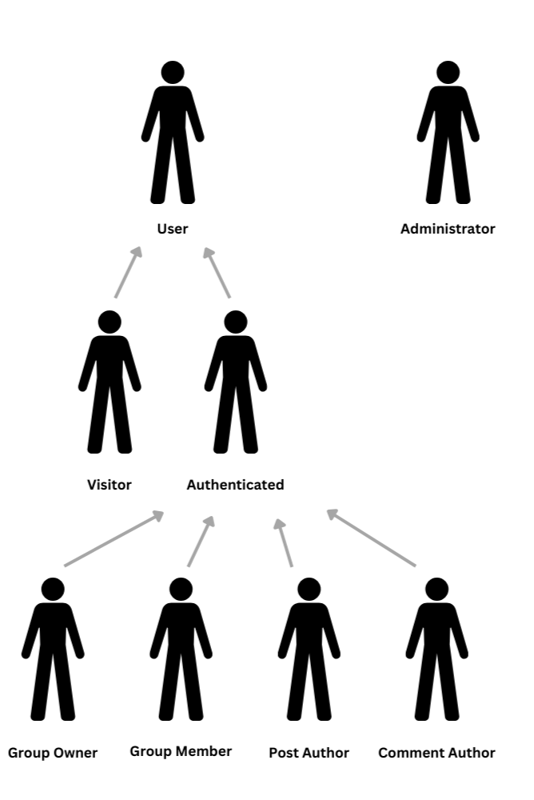
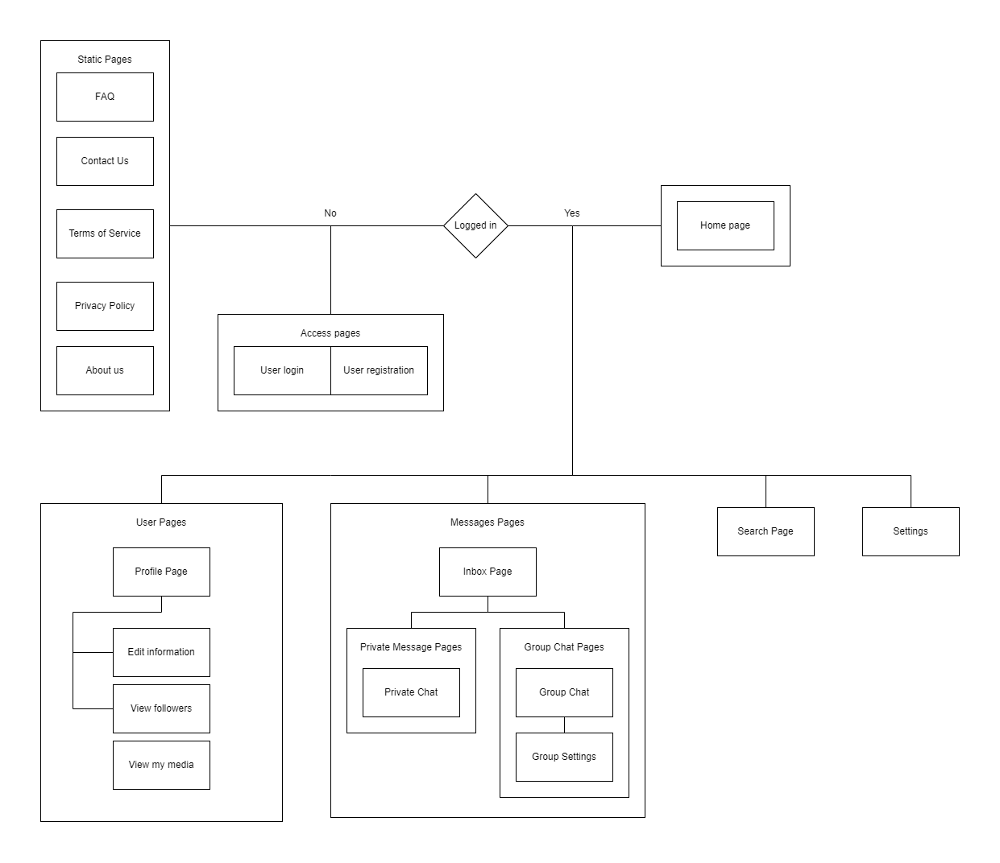
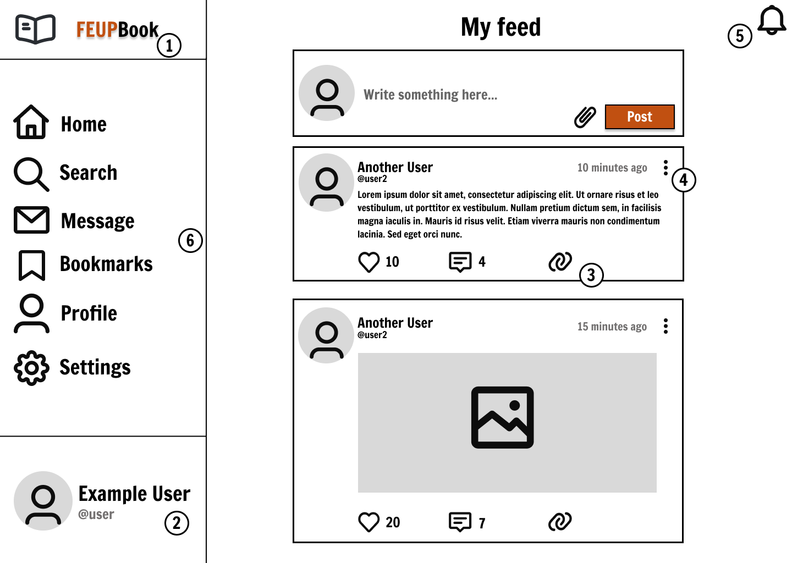
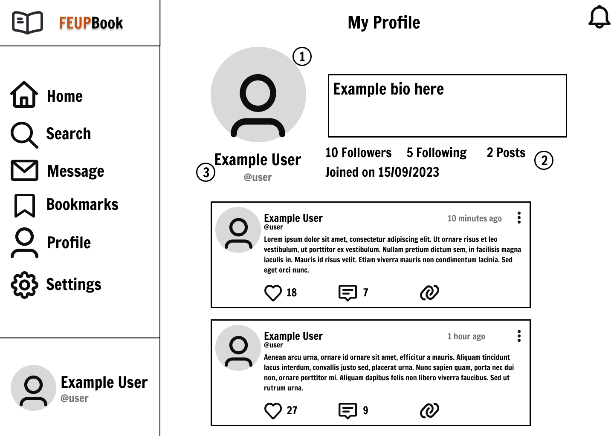
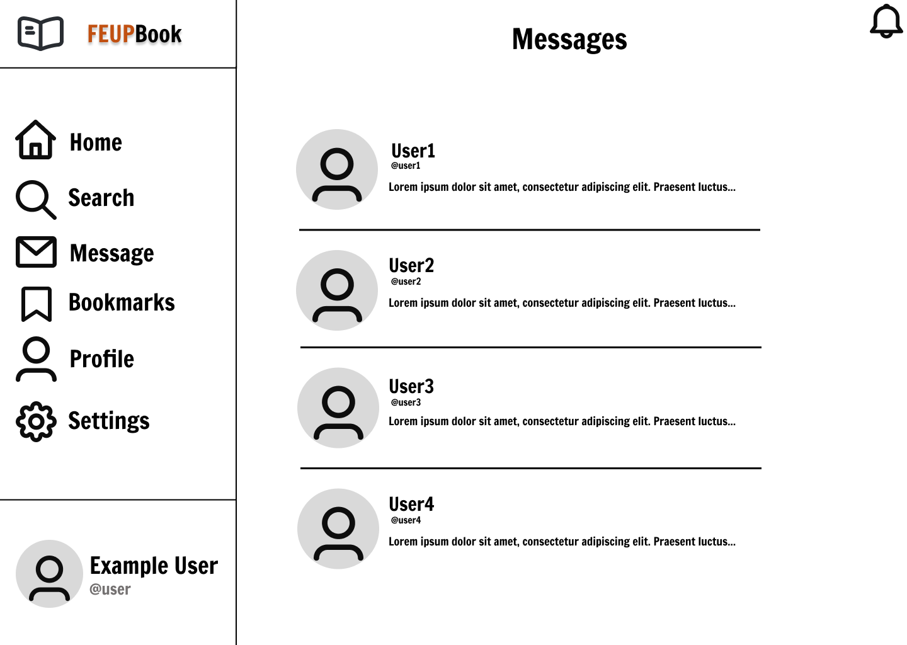
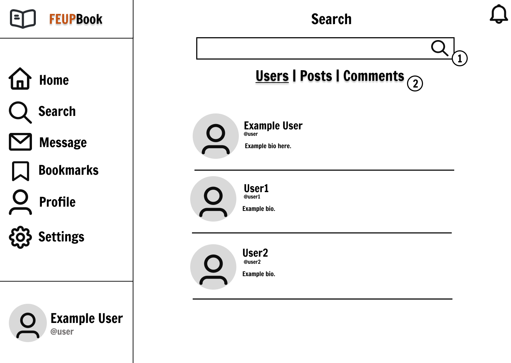

# ER: Requirements Specification Component

At the heart of our project vision for Feupbook is the unwavering commitment to creating an innovative and vibrant social network tailored specifically for the students of the Faculty of Engineering at the University of Porto (FEUP). We envision Feupbook as a dynamic and inclusive online ecosystem, revolutionizing the way FEUP students connect, share, and engage within their academic community.

## A1: Feupbook - Connecting FEUP Students

### Introduction:
Feupbook is an innovative social network created by a dedicated group of FEUP students. Our motivation behind this project stemmed from the need for a platform that seamlessly connects all students within the FEUP community.

### Objective:
The primary goal of Feupbook is to establish a dynamic online environment where FEUP students can effortlessly share their daily university experiences. This platform fosters the opportunity to meet new people and exchange various academic and social encounters. Importantly, Feupbook is exclusively accessible to students currently enrolled in a degree program at FEUP.

### Getting Started:

When users first enter Feupbook, they are greeted by a user-friendly sign-in page. For those who are new to the platform, a convenient "Don't have an account?" button seamlessly guides them to the sign-up page. Once registered, users become authenticated users and are instantly directed to the Feupbook home page.

#### Exploring the Home Page:

The home page serves as the central hub of Feupbook, offering a range of exciting features:

- **Public Feed:** Users can scroll through the public feed, where they'll find a diverse array of posts from other users, fostering interaction and connection within the community.
- **Profile Picture:** Located in the bottom-left corner, clicking on their profile picture allows users to switch accounts and sign out.
- **Navigation sidebar:** Located on the left of the page, this sidebar allows users access other pages of Feupbook, the search page, the messages page, the bookmarks page, their profile page and the settings page.

#### Direct Messaging and Group Chats:

Feupbook facilitates direct messaging between users, enhancing communication. Within the direct message interface, users can:

- View and manage all their conversations, making it effortless to stay connected.
- Form group chats, enabling multiple users to engage in collective discussions. Existing group chats are also conveniently accessible.

#### User Profiles:

Each authenticated user possesses a personalized profile, highlighting their presence within the Feupbook community:

- **Follower and Following Counts:** Users can proudly display the number of followers they have and the number of users they are following, emphasizing their network connections.
- **Bio Section:** The bio section allows users to express themselves by providing a brief introduction or personal message.
- **Timeline of Posts:** Posts are neatly organized, with the most recent ones displayed first, providing a chronological overview of the user's activity.
- **Privacy Settings:** Users have the flexibility to choose between a public or private profile. Private profiles ensure that only followers can access their posts.

#### Administrators:

Feupbook maintains a vigilant team of administrators committed to creating a positive and safe digital environment. These administrators utilize an interface identical to regular users but possess the ability to monitor all interactions across the platform, ensuring a pleasant experience for all.

### Conclusion:
In conclusion, Feupbook is a student-centric social network designed to facilitate connections and interactions among FEUP students. It provides a user-friendly platform for sharing experiences, making new acquaintances, and engaging in meaningful conversations. Our aim is to enhance the university experience for all FEUP students by promoting connectivity and communication within the community.

## A2: Actors and User stories

Actors and user stories contain information about the people that are going to use Feupbook and how they will use it.

### 2.1 Actors

Feupbook interacts with external identities in different ways, and gives them different kinds of permissions. The following table lists the actors relevant to this project.

Figure 1: Feupbook Actors

| Actor Identifier | Description |
| ------ | ------ |
|  User | Abstract user that has access to public information. |
|  Visitor      | Unauthenticated user that can register itself or sign-in in the system. Has access to public information.  |
|  Authenticated User      |  Authenticated user (has an account). Is able to post, comment on someone's posts, can send private messages and be part of group chats. |
| Group Owner | Authenticated user who owns a private chat group consisting of other users. |
| Group Member | Authenticated user who is part of a group chat, where it is possible to socialize with others. |
| Post Author | Authenticated user who is the author of a specific post. |
| Comment Author | Authenticated user who is the author of a specific comment on a post or another comment. |
| Administrator | Authenticated user with privileged permissions responsible for managing and moderating the social network. |

Table 1: Feupbook Actors Description

### 2.2 User Stories

Feupbook should house a large number of features that should allow users to interact with one another, as well as provide administrators with tools to assure the flow of the social network. 

#### 2.2.1 User

| Identifier | Name | Priority | Description |
| ------ | ------ | ------ | ------ |
| US1 | View Public Pages | High | As a user I want to be able to see public pages (About us, FAQ, Help, Contacts), so that I can be informed about the network. |

Table 2: User user stories

#### 2.2.2 Visitor

| Identifier | Name | Priority | Description |
| ------ | ------ | ------ | ------ |
| US2 | Account registration | High |  As a visitor I want to be able to register an account whenever I want to do so.    |
| US3 | Log in | High | As a visitor I want to be able to log in in a fast, straightforward and secure way. |

Table 3: Visitor User Stories

#### 2.2.3 Authenticated User

| Identifier | Name | Priority | Description |
| ------ | ------ | ------ | ------ |
| US4 | Sign-out | High | As an authenticated user I want to be able to sign-out at any time so I'm not logged in anymore. |
| US5 | See Home Page | High | As an authenticated  user, I want to be able to see the home page in order to navigate the site. |
| US6 | View Personalized Feed | High | As an authenticated  user I want to be able to see a personalized feed, where only posts that I have interest in are shown. |
| US7 | Have Own Profile | High | As an authenticated  user I want to have my own profile so that I can keep record of my interactions. |
| US8 | View User Profiles | High | As an authenticated  user I want to be able to see other users' profiles. |
| US9 | Create a Post | High | As an authenticated  user, I want to be able to create posts , so that I am able to express my feelings and thoughts, thus interacting with the network. |
| US10 | Send Follow Request | High | As an authenticated  user, I want to be able to send, so that I show my intention to follow that user. |
| US11 | Follow public profile | High | As an authenticated user I want to be able to follow someone with a public profile, so that their posts start appearing on my feed. |
| US12 | Comment on posts | High | As an authenticated user I want to be able to comment on other peoples' posts, so that I can express my feelings regarding that post. |
| US13 | Search for Users | High | As an authenticated user I want to be able to search for other users easily and efficiently, so that I can see what is relevant for me. |
| US14 | Account Deletion | Medium | As an authenticated  user, I want to be able to delete my account, so that I am able to move on from the social network if I feel so. |
| US15 | Managed Received Follow Requests | Medium | As an authenticated user I want to be able to either accept or reject incoming follow requests, so that I can manage who can follow me or not. |
| US16 | Followers management | Medium | As an authenticated user I want to be able to manage my followers, so that if I decide to remove someone from following me, I can. |
| US17 | Private Messaging | Medium | As an authenticated  user, I want to be able to private message any user in Feupbook. |
| US18 | Group chat creation | Medium | As an authenticated  user, I want to be able to create a chat group with other users so that we can easily interact with each other in a private way. |
| US19 | Post deletion | Medium | As an authenticated  user, I want to be able to delete a post if I ever come to regret making it. |
| US20 | Profile customization | Medium | As an authenticated  user, I want to be able to edit my profile, namely my profile picture, username, and bio. |
| US21 | Like a post | Medium | As an authenticated user I want to be able to like a post, so that I can show my liking of it. |
| US22 | Bookmark a Post | Medium | As an authenticated user I want to be able to bookmark a post, so that I can save my favorite posts and find them easily. |
| US23 | Like a comment | Medium | As an authenticated user I want to be able to like a comment, so that I can show my support of it. |
| US24 | Account management | Medium | As an authenticated  user, I want to be able to manage my account settings, including being able to reset my password if needed. |
| US25 | Post notifications | Low | As an authenticated  user, I want my followers to receive notifications whenever I make a post. |
| US26 | Comment notifications | Low | As an authenticated  user, I want my followers to receive notifications whenever I comment on a post. |
| US27 | Reply to Comments | Low | As an authenticated user I want to be able to reply to other users' comments, so that I can discuss about that comment. |
| US28 | Follow Request Notification | Low | As an authenticated user I want to receive a follow request notification whenever someone requests to follow me, so that I keep informed about potential followers. |
| US29 | Accepted Follow Notification | Low | As an authenticated user I want to receive a notification when other users accept my follow request, so that I know if I can finally see their content. |
| US30 | Started Following Notification | Low | As an authenticated user I want to receive a notification when someone starts to follow me, so that I can keep track of new followers. |
| US31 | Tag Users in Posts | Low | As an authenticated users I want to be able to tag someone in my post, so that people viewing my post know who is part of it. |
| US32 | Tag in Post Notification | Low | As an authenticated user I want to receive a notification when someone tags me in their post, so that I know of it. |
| US33 | Notification preferences | Low | As an authenticated  user, I want to be able to personalize which kind of notifications I want to receive. |
| US34 | Delete Notifications | Low | As an authenticated user I want to be able to delete old notifications, so that I can keep my notifications page neat. |
| US35 | Post reporting | Low | As an authenticated  user, I want to be able to report another user's post if I think it's inappropriate or makes me feel uncomfortable. |
| US36 | Give feedback | Low | As an authenticated  user, I want to be able to give feedback, so I can help improve the platform. |
| US37 | Messages Status | Low | As an authenticated user I want to see if there are any new unseen message, so that I can see who contacted me. |

Table 4: Authenticated User user stories

#### 2.2.4 Group Owner

| Identifier | Name | Priority | Description |
| ------ | ------ | ------ | ------ |
| US38 | Member management | Medium | As a group owner, I want to be able to add and remove group members from the group chat. |
| US39 | Group customization | Medium | As a group owner, I want to be able to edit the group name, and picture. |
| US40 | Content moderation | Medium | As a group owner, I want to be able to moderate / delete content, if it is inappropriate. |
| US41 | Group deletion | Medium | As a group owner, I want to be able to permanently delete the group, if I need to do so. |
| US42 | Ownership transfering | Low | As a group owner, I want to be able to transfer the ownership of the group to another user if I no longer wish to be the owner of that group. |
| US43 | Group Notifications | Low | As a group owner, I want to receive group related notifications (for example, if a member has left the group). |

Table 5: Group Owner user stories

#### 2.2.5 Group Member

| Identifier | Name | Priority | Description |
| ------ | ------ | ------ | ------ |
| US44 | View group members | Medium | As a group member I want to be able to see all the users that are part of a group. |
| US45 | Share content on a group | Medium | As a group member I want to be able to share the content I want, so that all members can see my ideas. |
| US46 | Leave group | Medium | As a group member I want to be able to leave a group whenever I want, so that I don't see the content shared in that group. |
| US48 | Kick Notification | Low | As a group member I want to receive a notification once I am kicked out of a group. |
| US49 | Ownership Notification | Low | As a group member I want to be able to receive a notification once I become the owner of a group. |

Table 6: Group Member user stories

#### 2.2.6 Post Author

| Identifier | Name | Priority | Description |
| ------ | ------ | ------ | ------ |
| US50 | Edit Post | High | As a post author I want to be able to edit my own post, so that I can correct it. |
| US51 | Delete Post | High | As a post author I want to be able to delete my own post, so that I can remove something I regret posting. |
| US52 | Likes on Own Post Notification | Medium | As a post author I want to receive a notification for each time someone likes my post, so that I can keep track of my post's success. |
| US53 | Comments on Own Post Notification | Medium | As a post author I want to receive a notification each time someone comments on my post, so that I know what people think about it. |
| US54 | Manage Post Visibility | Medium | As a post author I want to be able to manage the users who see my post, so that I can share content more privately. |
| US55 | Post Media | Low | As a post author I want to be able to post photos or videos, so that I can post more than only text in order to share my experiences better. |

Table 7: Post Author user stories

#### 2.2.7 Comment Author

| Identifier | Name | Priority | Description |
| ------ | ------ | ------ | ------ |
| US56 | Edit comment | Medium | As a comment author I want to be able to edit my own comment, so that I can change something I did not like.
| US57 | Delete comment | Medium | As a comment author I want to be able to delete my own comment, so that I can remove something I regret saying. |
| US58 | Replies on Own Comment Notification | Low | As a comment author I want to receive a notification each time someone comments my comment, so that I know the users' feedback. |

Table 8: Comment Author user stories

#### 2.2.8 Administrator

| Identifier | Name | Priority | Description |
| ------ | ------ | ------ | ------ |
| US59 | User account management | High | As an administrator, I want to be able to manage user details, including password changing. |
| US60 | Post and comment moderation | Medium  | As an administrator, I want to be able to delete a post or comment if I feel it violates the social network rules. |
| US61 |  User moderation | Medium | As an administrator, I want to be able to issue warnings, and temporary / permanent suspend a user if needed.  |
| US62 | Guidelines and rule moderation | Medium | As an administrator, I want to be able to write or change the website guidelines to create a safer and less toxic environment. |
| US63 | Report handling | Low | As an administrator, I want to have access to analytics such as user reports, in order to handle them properly. |
| US64 | Feedback | Low | As an administrator, I want to have access to user feedback, so I can improve / add new features to the website. |
| US65 | Group Chat deletion | Low | As an administrator, I want to be able to delete a group chat if it is breaking the rules, so that I keep the network safe. |

Table 9: Administrator user stories

### 2.3 Supplementary Requirements

#### 2.3.1 Business rules

| Identifier | Name | Description |
| ------ | ------ | ------ |
| BR1 | Deleted accounts | Deleted accounts' history, such as posts and comments, should be maintained in an anonymous way in order not to lose the loan record for all items. |
| BR2 | Profile privacy | Users can choose to make their profiles public or private, the latter being only visible to followers and administrators. |
| BR3 | Restricted to FEUP students | The social network is only meant for FEUP students, only being accessible through FEUP's private internet or through the use of FEUP's VPN. |
| BR4 | Account termination | Accounts who repeatedly violate guidelines may be terminated. |
| BR5 | Post and comment dates | Post and comment dates should either be equal or less than the current date. |
| BR6 | Interact with own Posts | Authenticated user can comment and like their own posts/comments.|

Table 10: Feupbook Business Rules

#### 2.3.2 Technical requirements

| Identifier | Name | Description |
| ------ | ------ | ------ |
| TR1 | Availability | The system must be available 99 percent of the time everyday. |
| TR2 | Accessibility | The system must ensure that everyone, including individuals with disabilities, can access and interact with the pages, regardless of the web browser. |
| **TR3** | **Usability** | **The system should be simple and easy to use. The Feupbook social network is designed to be used by any Feup student, regardless of their age and technical experience, so really good usability is a critical requirement.** |
| TR4 | Performance | The system should be responsive with minimal latency. |
| **TR5** | **Security** | **The system must implement robust security measures to ensure the confidentiality of user information. User data must only be accessible to the respective user, individuals explicitly granted access by the user, and authorized administrators of the social network. Unauthorized access or data leaks must be prevented through encryption, access controls, and regular security audits.** |
| TR5 | Scalability | The platform should be able to handle an increasing number of users without massive performance impact. |
| **TR6** | **Web Application** | **The system must be implemented as a web application (HTML, CSS, JavaScript, PHP). It is critical that Feupbook is accessible from anywhere without the need to install specific software.** | 
| TR7 | Robustness | The system must demonstrate high robustness, ensuring uninterrupted performance even under heavy user loads and in the face of unexpected errors or disruptions, to provide a reliable user experience. |

Table 11: Feupbook Technical Requirements

#### 2.3.3 Restrictions

| Identifier | Name | Description |
| ------ | ------ | ------ |
| R1 | Deadline | The system should be available to use by the end of the semester. |
| R2 | Database | The database should be in PostgreSQL. |

Table 12: Feupbook Restrictions

---

## A3: Information Architecture

The image below shows which pages are going to exist in Feupbook and how they will be connected. It represents how the website will function.

### 3.1 Sitemap

Figure 2: Feupbook Sitemap

### 3.2 Wireframes

In the following section, we provide a visual representation of the user interface and interaction design through wireframes, which serve as a blueprint for the user interface elements, layout, and functionality of the social network platform.

#### UI01: Home Page

Figure 3: Feupbook Home Page

1. FEUPBook logo. Takes user to the home page.
2. User details. Also allows to switch accounts and log out.
3. Buttons used to interact and share posts.
4. Post options. Allows post deletion (if it's the owner), and post reporting.
5. Notifications icon.
6. Sidebar that allows user to navigate to different parts of the social network.

#### UI02: Profile Page

Figure 4: Feupbook Profile Page

1. User profile picture. Clicking allows the user to change it.
2. Follower and post metrics. Clicking on each allows to see following and follower accounts, respectively.
3. Username and tag. Clicking allows the user to change them.

#### UI03: Messages Page

Figure 5: Feupbook Messages Page

#### UI04: Search Page

Figure 6: Feupbook Search Page

1. Search bar.
2. Filter options.

---

## Revision history

Changes made to the first submission:
1. Item 1
1. ...

***
GROUP141, 04/10/2023

* Group member 1 Filipe Jacob De Jesus Ferreira, up202102359@up.pt
* Group member 2 Luís Miguel Lima Tavares, up202108662@up.pt
* Group member 3 Miguel Martins Leitão, up202108851@up.pt
* Group member 4 Rodrigo Campos Rodrigues, up202108847@up.pt

