# PA: Product and Presentation

At the heart of our project vision for Feupbook is the unwavering commitment to creating an innovative and vibrant social network tailored specifically for the students of the Faculty of Engineering at the University of Porto (FEUP). We envision Feupbook as a dynamic and inclusive online ecosystem, revolutionizing the way FEUP students connect, share, and engage within their academic community.

## A9: Product

The Feupbook final product is the result of the implementation of the information system designed in the previous stages (A1 to A8), using PHP and Laravel Framework to produce dynamic web pages, AJAX for a better user experience and PostgreSQL as a database. <br><br> 
The main goal of this project is the development of a web-based social network for the students of FEUP, where they can share their experiences, ask questions, and interact with each other.

### 1. Installation


The final version of the source code is available [here](https://git.fe.up.pt/lbaw/lbaw2324/lbaw23141/-/tags) in PA tag.

Full Docker command to launch the image available in the group's GitLab Container Registry using the production database:
```
docker run -it -p 8000:80 --name=lbaw23141 -e DB_DATABASE="lbaw23141" -e DB_SCHEMA="lbaw23141" -e DB_USERNAME="lbaw23141" -e DB_PASSWORD="kJrVHWaX" git.fe.up.pt:5050/lbaw/lbaw2324/lbaw23141
```

### 2. Usage

The application is available at https://lbaw23141.lbaw.fe.up.pt.  

#### 2.1. Administration Credentials

| Email | Password |
| -------- | -------- |
| gcostell0@simplemachines.org | admin123 |

Table 48: Feupbook administration credentials

#### 2.2. User Credentials

| Type          | Username  | Password |
| ------------- | --------- | -------- |
| basic account | alice.smith@example.com | password2 |

Table 49: Feupbook user credentials

### 3. Application Help

Features related to help can be visualized on some static pages, such as "Help", "About Us", "Contact Us" and "FAQ".<br><br>
These pages are accessible through the footer of the application on the welcome, login and register pages, and through the sidebar of the application on the rest of the pages. These pages can also be accessed by their url path, like /help, /about, /contact and /faq.


Figure 8: Footer of the application with links to static pages

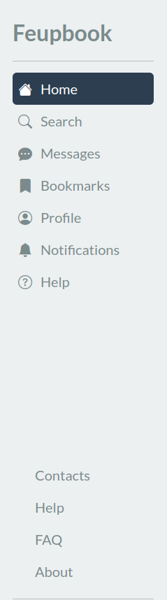

Figure 9: Sidebar of the application with links to static pages

On the "Help" page the user is informed about where he can search for information both in the "FAQ" and in the "Contact Us" page.

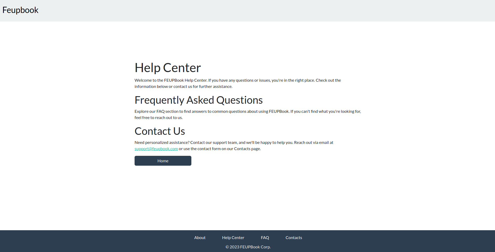

Figure 10: Feupbook Help page

On the "About Us" page the user can find information about the purpose of the application.

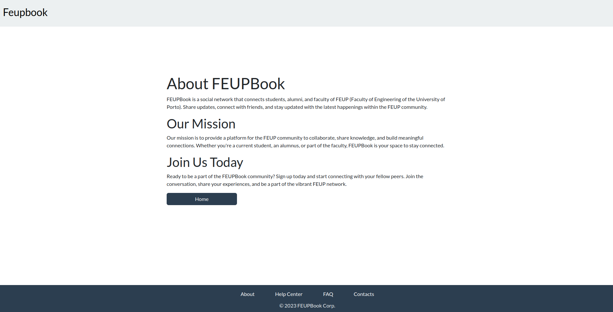

Figure 11: Feupbook About Us page

On the "Contact Us" page the user can find information about how to contact the Feupbook team.

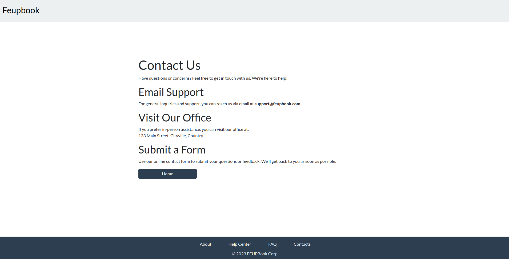

Figure 12: Feupbook Contact Us page

On the "FAQ" page the user can find answers to the most frequently asked questions.

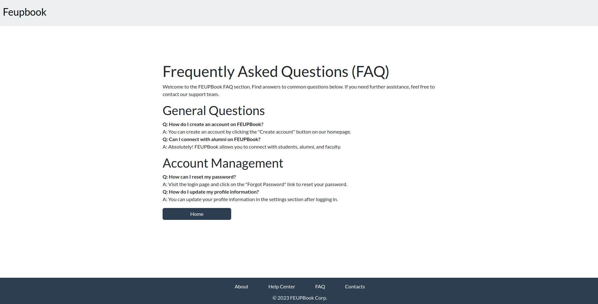

Figure 13: Feupbook FAQ page

Alert messages were implemented, such as error/success messages, to keep the user informed about what is happening on the application.

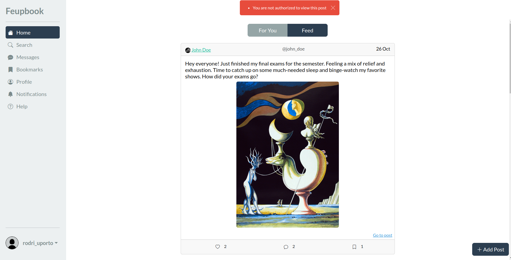

Figure 14: View Post error message

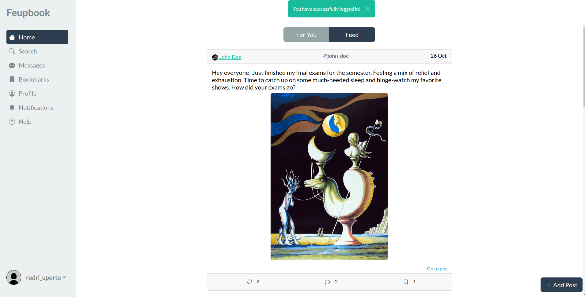

Figure 15: Example of success message

### 4. Input Validation

As the back-end input validation we utilized the validate function available on the Illuminate\Http\Request class through the Laravel framework. This function allows us to validate the request data before any other logic is executed. This function was used to validate various of our forms, such as the login/register forms and the create/edit post forms. The validation rules were defined according to the requirements of each form.

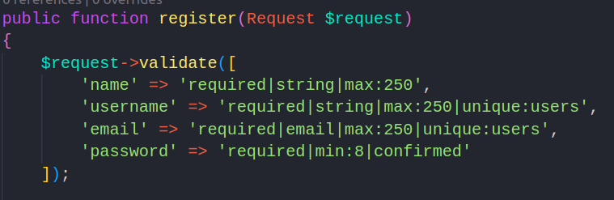

Figure 16: Back-end register form input validation

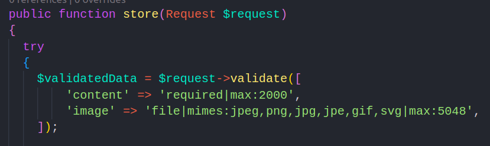

Figure 17: Back-end create post form input validation

As the front-end input validation we used javascript to validate the deletion of posts and comments. The user is asked to confirm the deletion of the post/comment before it is deleted.

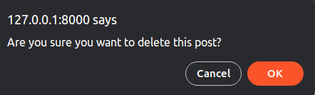

Figure 18: Front-end post deletion input validation

### 5. Check Accessibility and Usability

[Accessibility Checklist](https://ux.sapo.pt/checklists/acessibilidade/): 16/18 <br> 
[Usability Checklist](https://ux.sapo.pt/checklists/usabilidade/): 25/28   

### 6. HTML & CSS Validation 

[Create Post HTML validation](uploads/create-post-html-validation.pdf) - the error shown is due to the use of the `@csrf` laravel method. <br>

[Followers HTML validation](uploads/followers-html-validation.pdf) - the errors shown are due to the use of the `@csrf` laravel method. <br>

[Profile HTML validation](uploads/profile-html-validation.pdf) - the error shown is due to the use of the `@csrf` laravel method. <br>

[CSS Validation](uploads/CSS-validation.pdf)

### 7. Revisions to the Project

Some changes were made to the project since the requirements specification stage.

**Database**

- Added user_type attribute to users table to differentiate between normal, suspended and deleted users and administrators.
- Added avatar attribute to users table to store the path to the user's avatar image.
- Added provider, provider_id and provider_token, to meet social login requirements.
- Replaced date atributte with created_at and updated_at attributes, on posts table, to meet Laravel conventions.
- Replaced date atributte with created_at and updated_at attributes, on comments table, to meet Laravel conventions.

**User stories**
- Lowered priority of US40, US55 and US61: all the user stories priority was lowered because the relevance of the user stories was not enough to justify the priority they had.

- US53 not implemented by advice of the teacher. User story was too complicated for the relevance it had in the project.

**Web Resources Specification**

Implemented Web Resources:

Module M01: Authentication

| Web Resource Reference | URL                            |
| ---------------------- | ------------------------------ |
| R101: Login Form | GET [/login](https://lbaw23141.lbaw.fe.up.pt/login) |
| R102: Login Action | POST /login |
| R103: Logout Action | POST /logout |
| R104: Register Form | GET [/register](https://lbaw23141.lbaw.fe.up.pt/register) |
| R105: Register Action | POST /register |
| R106: Social Login | GET /auth/{provider}/redirect |
| R107: Social Login Callback | GET /auth/{provider}/callback |

Table 50: Authentication implementation

Module M02: Users

| Web Resource Reference | URL                            |
| ---------------------- | ------------------------------ |
| R201: View home page | GET [/home](https://lbaw23141.lbaw.fe.up.pt/home) |
| R202: View for you home page | GET [/home/forYou](https://lbaw23141.lbaw.fe.up.pt/home/forYou) |
| R203: View user profile | GET [/user/{id}](https://lbaw23141.lbaw.fe.up.pt/user/2) |
| R204: Follow Action | POST /user/{id}/follow |
| R205: Unfollow Action | POST /user/{id}/unfollow |
| R206: View about page | GET [/about](https://lbaw23141.lbaw.fe.up.pt/about) |
| R207: View help page | GET [/help](https://lbaw23141.lbaw.fe.up.pt/help) |
| R208: View faq page | GET [/faq](https://lbaw23141.lbaw.fe.up.pt/faq) |
| R209: View contacts page | GET [/contacts](https://lbaw23141.lbaw.fe.up.pt/contacts) |
| R210: View edit profile page | GET [/user/{id}/edit](https://lbaw23141.lbaw.fe.up.pt/user/2/edit) |
| R211: Edit profile action | PUT /user/{id}/update |
| R212: View followers page | GET [/user/{id}/followers](https://lbaw23141.lbaw.fe.up.pt/user/2/followers) |
| R213: View following page | GET [/user/{id}/following](https://lbaw23141.lbaw.fe.up.pt/user/2/following) |
| R214: Delete account action | PUT /user/{id}/delete |
| R215: Remove follower action | POST /user/{id}/removeFollower |
| R216: Update password action | PUT /user/{id}/updatePassword |
| R217: Update profile picture action | PUT /user/{id}/updateProfilePicture |
| R218: View Report Form | GET [/user/{id}/report](https://lbaw23141.lbaw.fe.up.pt/user/2/report) |
| R219: Submit Report Action | POST /user/{id}/submitReport |

Table 51: Users implementation

Module M03: Posts

| Web Resource Reference | URL                            |
| ---------------------- | ------------------------------ |
| R301: View create post page | GET [/post/create](https://lbaw23141.lbaw.fe.up.pt/post/create) |
| R302: Create post action | POST /post/create |
| R303: View post page | GET [/post/{id}](https://lbaw23141.lbaw.fe.up.pt/post/3) |
| R304: View edit post page | GET [/post/{id}/edit](https://lbaw23141.lbaw.fe.up.pt/post/3/edit) |
| R305: Edit post action | POST /post/{id}/edit |
| R306: Delete post action | DELETE /post/{id}/delete |
| R307: Like post action | POST /post/{id}/like |
| R308: Dislike post action | POST /post/{id}/dislike |
| R309: Bookmark post action | POST /post/{id}/bookmark |
| R310: Unbookmark post action | POST /post/{id}/unbookmark |
| R311: View bookmarked posts page | GET [/post/bookmarks](https://lbaw23141.lbaw.fe.up.pt/post/bookmarks) |
| R312: View Report Form | GET [/post/{id}/report](https://lbaw23141.lbaw.fe.up.pt/post/3/report) |
| R313: Submit Report Action | POST /post/{id}/submitReport |

Table 52: Posts implementation

Module M04: Search

| Web Resource Reference | URL                            |
| ---------------------- | ------------------------------ |
| R401: View search page | GET [/search](https://lbaw23141.lbaw.fe.up.pt/search) |
| R402: Search for user | GET [/api/user](https://lbaw23141.lbaw.fe.up.pt/api/user?query=admin1)|

Table 53: Search implementation

Module M05: Administration

| Web Resource Reference | URL                            |
| ---------------------- | ------------------------------ |
| R501: View admin user edit page | GET [/admin/user/{id}/edit](https://lbaw23141.lbaw.fe.up.pt/admin/user/1/edit) |
| R502: Admin edit user action | POST /admin/user/{id}/edit |
| R503: Admin delete user action | POST /admin/user/{id}/delete |
| R504: Admin suspend user action | POST /admin/user/{id}/suspend |
| R505: Admin unsuspend user action | POST /admin/user/{id}/unsuspend |
| R506: Admin restore user action | POST /admin/user/{id}/restore |
| R507: Admin page | GET [/admin/manage](https://lbaw23141.lbaw.fe.up.pt/admin/manage) |
| R508: Admin delete report action | DELETE /admin/report/{id}/delete |
| R509: Admin view filtered reports | GET [/admin/reports](https://lbaw23141.lbaw.fe.up.pt/admin/reports) |

Table 54: Administration implementation

Module M06: Comments

| Web Resource Reference | URL                            |
| ---------------------- | ------------------------------ |
| R601: Create comment action | POST /comment/create |
| R602: Delete comment action | DELETE /comment/{id}/delete |
| R603: Like comment action | POST /comment/{id}/like |
| R604: Dislike comment action | POST /comment/{id}/dislike |

Table 55: Comments implementation

Module M07: Notifications

| Web Resource Reference | URL                            |
| ---------------------- | ------------------------------ |
| R701: View notifications page | GET [/notifications/{id}](https://lbaw23141.lbaw.fe.up.pt/notifications{id}) |

Table 56: Notifications implementation

Module M08: Group chats

| Web Resource Reference | URL                            |
| ---------------------- | ------------------------------ |
| R801: View group chats page | GET [/group-chats](https://lbaw23141.lbaw.fe.up.pt/group-chats) |
| R802: Show group chat | GET [/group-chats/{groupChat}](https://lbaw23141.lbaw.fe.up.pt/group-chats/{groupChat}) |
| R803: Edit group chat | GET [/group-chats/{groupChat}/edit](https://lbaw23141.lbaw.fe.up.pt/group-chats/{groupChat}/edit) |
| R804: Send message in group chat | POST /group-chats/{groupChat}/send-message |
| R805: Get messages in group chat | GET [/group-chats/{groupChat}/messages](https://lbaw23141.lbaw.fe.up.pt/group-chats/{groupChat}/messages) |
| R806: Create group chat | POST /group-chats/create |
| R807: Add member to group chat | POST /group-chats/{groupChat}/add-member |
| R808: Remove member from group chat | POST /group-chats/{groupChat}/remove-member |
| R809: Update group chat | POST /group-chats/{groupChat}/update |
| R810: Accept invite to group chat | POST /group-chats/{groupChat}/accept-invite |
| R811: Reject invite to group chat | POST /group-chats/{groupChat}/reject-invite |
| R812: Delete group chat | DELETE /group-chats/{groupChat}/delete |
| R813: Get accepted members of group chat | GET [/group-chats/{groupChat}/members](https://lbaw23141.lbaw.fe.up.pt/group-chats/{groupChat}/members) |

Module M09: Api

| Web Resource Reference | URL                            |
| ---------------------- | ------------------------------ |
| R901: Load feed posts | GET [/api/loadFeed](https://lbaw23141.lbaw.fe.up.pt/api/loadFeed) |
| R902: Load for you posts | GET [/api/loadForYou](https://lbaw23141.lbaw.fe.up.pt/api/loadForYou) |
| R903: Reload Notifications | GET [/api/notifications](https://lbaw23141.lbaw.fe.up.pt/api/notifications) |

### 8. Implementation Details

#### 8.1. Libraries Used

Libraries and Frameworks Used

- [Laravel](https://laravel.com/), for server-side management;
- [Bootstrap](https://getbootstrap.com/), for responsive design;
- [FontAwesome](https://fontawesome.com/), for icons and buttons.  
- [Pusher](https://pusher.com/), for real-time chats.

#### 8.2 User Stories

| US Identifier | Name    | Module | Priority                       | Team Members               | State  |
| ------------- | ------- | ------ | ------------------------------ | -------------------------- | ------ |
| US1 | View Public Pages | M02| High | Luís Tavares, Rodrigo Rodrigues | 100% |
| US2 | Account registration | M01 |High | Luís Tavares | 100% |
| US3 | Log in | M01 | High | Luís Tavares | 100% |
| US4 | Sign-out | M01 | High | Luís Tavares | 100% |
| US5 | See Home Page | M02 | High | Rodrigo Rodrigues | 100% |
| US6 | View Personalized Feed | M02 | High | Rodrigo Rodrigues | 100% |
| US7 | Have Own Profile | M02 | High | Miguel Leitão | 100% |
| US8 | View User Profiles | M02 | High | Miguel Leitão | 100% |
| US9 | Create a Post | M03 | High | Rodrigo Rodrigues | 100% |
| US10 | Send Follow Request | M02 | High | Luís Tavares, Miguel Leitão | 100% |
| US11 | Follow public profile | M02 | High | Luís Tavares, Miguel Leitão | 100% |
| US12 | Comment on posts | M06 | High | Filipe Ferreira | 100% |
| US13 | Search for Users | M04 | High | Luís Tavares, Filipe Ferreira, Miguel Leitão | 100% |
| US14 | Account Deletion | M02 | Medium | Miguel Leitão | 100% |
| US15 | Managed Received Follow Requests | M02 | Medium | Filipe Ferreira | 100% |
| US16 | Followers management | M02 | Medium | Miguel Leitão | 100% |
| US17 | Private Messaging | M08 | Medium | Luís Tavares | 50% |
| US18 | Group chat creation | M08 | Medium | Luís Tavares | 100% |
| US19 | Post deletion |  M03 | Medium | Rodrigo Rodrigues | 100% |
| US20 | Profile customization | M02 | Medium | Miguel Leitão | 100% |
| US21 | Like a post | M03 | Medium | Rodrigo Rodrigues | 100% |
| US22 | Bookmark a Post | M03 | Medium | Rodrigo Rodrigues | 100% |
| US23 | Like a comment | M06 | Medium | Filipe Ferreira | 100% |
| US24 | Account management | M02 | Medium | Miguel Leitão | 100% |
| US25 | Post notifications | M07 | Low | Filipe Ferreira | 100% |
| US26 | Comment notifications | M07 | Low | Filipe Ferreira | 100% |
| US27 | Reply to Comments | M06 | Low | Filipe Ferreira | 100% |
| US28 | Follow Request Notification | M07| Low | Filipe Ferreira | 100% |
| US29 | Accepted Follow Notification | M07 | Low | Filipe Ferreira | 100% |
| US30 | Started Following Notification | M07 | Low | Filipe Ferreira | 100% |
| US31 | Tag Users in Posts | M03 | Low | Rodrigo Rodrigues | 100% |
| US32 | Tag in Post Notification | M07 | Low | - | 0% |
| US33 | Notification preferences | M07 | Low | - | 0% |
| US34 | Delete Notifications | M07 | Low | - | 0% |
| US35 | Post reporting | M03 | Low | Miguel Leitão | 100% |
| US36 | Give feedback | M02 | Low | - | 0% |
| US37 | Messages Status | M08 | Low | - | 0% |
| US38 | Member management | M08 | Medium | Luís Tavares | 100% | 
| US39 | Group customization | M08 | Medium | Luís Tavares | 100% |
| US40 | Content moderation | M08 | Low | - | 0% |
| US41 | Group deletion | M08 | Medium | Luís Tavares | 100% |
| US42 | Ownership transfering | M08 | Low | - | 0% |
| US43 | Group Notifications | M07 | Low | Filipe Ferreira | 100% |
| US44 | View group members | M08 | Medium | Luís Tavares | 100% |
| US45 | Share content on a group | M08 | Medium | Luís Tavares | 100% |
| US46 | Leave group | M08 | Medium | Luís Tavares | 100% |
| US47 | Kick Notification | M07 | Low | - | 0% |
| US48 | Ownership Notification | M07 | Low | - | 0% |
| US49 | Edit Post | M03 | High | Rodrigo Rodrigues | 100% |
| US50 | Delete Post | M03 | High | Rodrigo Rodrigues | 100% |
| US51 | Likes on Own Post Notification | M07 | Medium | Filipe Ferreira | 100% |
| US52 | Comments on Own Post Notification | M07 | Medium | Filipe Ferreira | 100% |
| US53 | Manage Post Visibility | Medium | - | 0% |
| US54 | Post Media | M03 | Low | Rodrigo Rodrigues | 100% |
| US55 | Edit comment | M06 | Low | - | 0% |
| US56 | Delete comment | M06 | Medium | Filipe Ferreira | 100% |
| US57 | Replies on Own Comment Notification | M07 | Low | Filipe Ferreira | 100% |
| US58 | User account management | M05 | High | Miguel Leitão | 100% |
| US59 | Post and comment moderation | M05 | Medium  | Miguel Leitão | 100% |
| US60 | User moderation | M05 | Medium | Miguel Leitão | 100% |
| US61 | Guidelines and rule moderation | M05 | Low | - | 0% |
| US62 | Report handling | M05 | Low | Miguel Leitão | 100% |
| US63 | Feedback | M05 | Low | - | 0% |
| US64 | Group Chat deletion | M08 | Low | Luís Tavares | 100% |

---

## A10: Presentation

The goal of this artifact is to present the product to the client.

### 1. Product presentation

Feupbook is an innovative social network exclusively designed for the Faculty of Engineering at the University of Porto (FEUP). This platform revolutionizes the way students and faculty members interact, collaborate, and share knowledge. With Feupbook you can create posts, comment on them, and share your experiences with the FEUP community. You can also follow your friends and colleagues, and keep up with their latest posts. Feupbook also allows you to create group chats, where you can share information and collaborate with your colleagues. Feupbook is the perfect tool to help you succeed in your academic journey.

Feupbook is a web-based application made with HTML5, JavaScript and CSS. The Bootstrap framework was used to make the application responsive. The Laravel framework was used to implement the server-side logic. The PostgreSQL database was used to store the application data. The application also features a simple navigation system with relevant information always on the same place, the sidebar. Most of the information can be found there but if you still have any questions you can always check the static pages.

URL to the product: http://lbaw23141.lbaw.fe.up.pt  

### 2. Video presentation

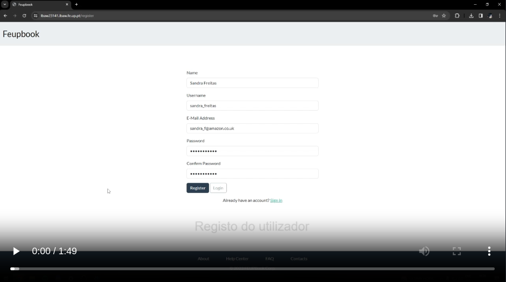 https://git.fe.up.pt/lbaw/lbaw2324/lbaw23141/-/blob/main/docs/lbaw23141.mp4

---


## Revision history

Changes made to the first submission:
1. Item 1
1. ..

***
GROUP141, 21/12/2023

* Group member 1 Filipe Jacob De Jesus Ferreira, up202102359@up.pt
* Group member 2 Luís Miguel Lima Tavares, up202108662@up.pt
* Group member 3 Miguel Martins Leitão, up202108851@up.pt
* Group member 4 Rodrigo Campos Rodrigues, up202108847@up.pt (editor)